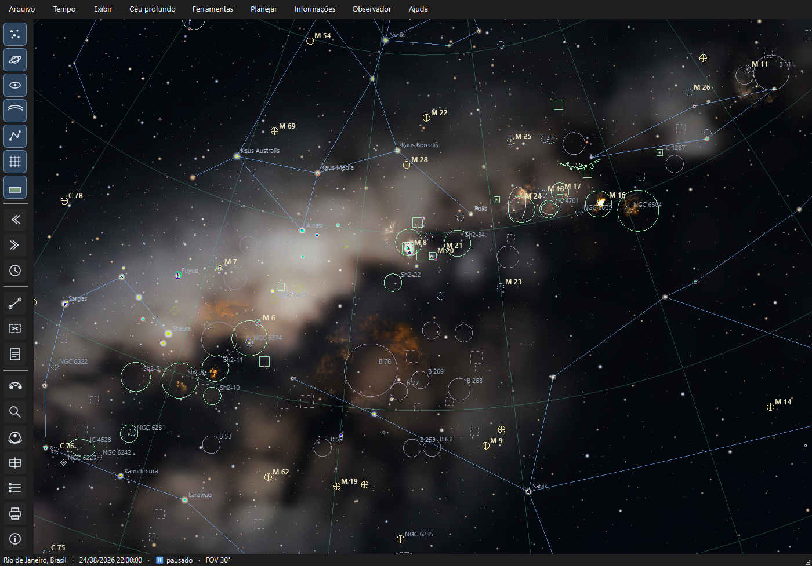

<div align="center">


# Carina

**Planetário de código aberto para quem observa o céu do quintal.**

Mostra o céu real do seu lugar e da sua hora — e o transforma em um plano
de observação: o que olhar hoje, a que horas, com qual instrumento e como
encontrar cada objeto.

[](#estado-do-projeto)
[](#estado-do-projeto)
[](#qualidade)
[](#licença)
[](#requisitos)

</div>

---

## Estado do projeto

> ### Versão 0.20.1 — **em desenvolvimento**
>
> **Este produto ainda está em desenvolvimento e não teve uma versão
> estável (1.0) lançada.** Ele já é plenamente usável para observação
> real — os cálculos astronômicos foram validados contra efemérides
> oficiais — mas ainda **não** é um produto acabado:
>
> - a interface e os formatos de arquivo **podem mudar** entre versões;
> - recursos novos entram a cada versão, e alguns ainda estão incompletos;
> - foi testado principalmente no **Windows 11**; Linux e macOS devem
>   funcionar, mas não passaram por testes sistemáticos;
> - podem existir defeitos ainda não descobertos.
>
> **Use para planejar e observar à vontade** — apenas não conte com
> estabilidade de interface entre uma versão e outra. Se algo parecer
> errado no céu ou nos horários, [reporte](#como-contribuir): precisão é
> a prioridade número um do projeto.

---

## O que o Carina faz

Um planetário mostra o céu. O Carina também **planeja a sua noite**.

| | Recurso | Resumo |
|---|---|---|
| 🌌 | **Céu realista** | 860 mil estrelas, Via Láctea fotográfica, atmosfera, refração e simulação de poluição luminosa (Bortle 1–9) |
| 🔭 | **Céu profundo** | 18.632 objetos de 11 catálogos, filtro de exibição por catálogo/tipo/magnitude/tamanho, nomes em português e 1.179 imagens reais do levantamento DSS embarcadas |
| 🪐 | **Planetas** | Janela de cada planeta com a melhor época no seu céu; fases de Mercúrio e Vênus; luas de Júpiter e Saturno vistas da Terra, com trânsitos e sombras; anéis na inclinação do dia; Grande Mancha Vermelha; discos no céu ao aproximar |
| 🌕 | **A Lua** | Globo com relevo, libração e nomes das formações; o que está no terminador hoje, planejador de foto lunar e Lunar 100 |
| 📅 | **Calendário do céu** | Eventos do mês para o seu local — Lua, eclipses, planetas, ocultações, meteoros — com lembretes e exportação .ics |
| 🌑 | **Eclipses** | Previsão de eclipses solares e lunares, com a visibilidade calculada para o seu local |
| 🌙 | **Hoje à noite** | Em uma tecla: a noite, a Lua, as horas escuras sem ela e os melhores alvos para o seu céu, cada um com nota de 0 a 100 explicada |
| 📋 | **Planejamento** | Roteiros com nasce/culmina/se põe e janela útil de cada alvo, linha do tempo arrastável, filtros e calendário de noites escuras |
| 🏠 | **Horizonte do quintal** | Desenhe a silhueta de prédios e árvores; o céu, as notas e os roteiros passam a respeitá-la |
| 📓 | **Diário e listas** | Listas de alvos com a nota da noite e diário de observação com condições, guardados no seu computador |
| 🗺️ | **Cartas de campo** | PDF com a carta geral da noite, checklist e uma carta de localização por objeto, em tema claro, escuro ou vermelho |
| 📷 | **Astrofotografia** | Sessão da noite com blocos de integração (meridiano e zênite), exposição sugerida, imageabilidade no ano, setups salvos, mosaico, "cabe no meu campo?" e minha foto no mapa |
| 🧭 | **Tours guiados** | O céu passo a passo: orientação, estrelas brilhantes, constelações, céu profundo, o céu de cada mês e da primavera, objetos do mês para fotografar; asterismos e as histórias das 88 constelações |
| 📱 | **Companheiro no celular** | O roteiro em vermelho no celular pelo QR code; o "observado" vai para o diário |
| 🛰️ | **ISS e satélites** | Passagens visíveis a partir de elementos orbitais importados, com trilha no céu |
| 🖨️ | **Cartas celestes** | Gerador de cartas com moldura, legenda, escala e bússola, em papel, escuro ou vermelho; perfis e atlas multipágina; anotações à mão livre |
| 🔴 | **No campo** | Modo noturno vermelho, tela cheia, modo observação com o próximo alvo e cronômetro, linha do tempo da noite no rodapé |

<div align="center">

<br><em>Sagitário e o centro da Via Láctea, com as imagens do levantamento DSS sobrepostas</em>
</div>

---

## Instalação rápida

### Windows — executável pronto

Abra a pasta `Carina` e execute **`Carina.exe`**. Não é preciso instalar
Python nem baixar catálogos: **tudo já vem embutido** e funciona
offline, inclusive as efemérides e as imagens dos objetos.

### A partir do código

```bash
python -m venv .venv
.venv/Scripts/python -m pip install -e ".[dev]"
.venv/Scripts/python -m carina
```

O guia completo — preparação dos dados, Linux, macOS e build do
executável — está em **[docs/INSTALACAO.md](docs/INSTALACAO.md)**.

---

## Primeiros cinco minutos

1. **Diga onde você está** — `Ctrl+L` e escolha sua cidade entre as 745
   disponíveis. Todos os horários passam a ser os do seu fuso.
2. **Ajuste o céu ao seu quintal** — *Exibir → Poluição luminosa* e
   escolha sua classe de Bortle. O céu na tela passa a mostrar o que
   você realmente enxerga daí.
3. **Veja o que vale hoje** — tecla **T** (*Hoje à noite*): a noite, a Lua
   e os melhores alvos para o seu céu, com nota e melhor hora.
4. **Peça um plano** — *Planejar → Roteiros → Melhores Objetos da Noite*.
5. **Leve para o campo** — na janela do plano, `Ctrl+Shift+V`
   pré-visualiza e `Ctrl+P` gera o PDF com as cartas de busca.

O passeio guiado completo está em
**[docs/PRIMEIROS_PASSOS.md](docs/PRIMEIROS_PASSOS.md)**.

---

## Documentação

Toda a documentação de uso está na pasta **[`docs/`](docs/)**:

| Documento | Para quem quer… |
|---|---|
| **[Instalação](docs/INSTALACAO.md)** | instalar no Windows, Linux ou macOS — ou compilar o próprio executável |
| **[Primeiros passos](docs/PRIMEIROS_PASSOS.md)** | um passeio guiado da primeira abertura até a primeira noite planejada |
| **[Funcionalidades](docs/FUNCIONALIDADES.md)** | conhecer tudo o que o programa faz, recurso por recurso |
| **[Interface](docs/INTERFACE.md)** | a referência completa: cada menu, botão e painel |
| **[Tours guiados](docs/TOURS.md)** | aprender o céu passo a passo |
| **[Companheiro no celular](docs/CELULAR.md)** | levar o roteiro para o lado do telescópio |
| **[Os planetas](docs/PLANETAS.md)** | saber quando e como ver cada planeta, as luas de Júpiter e os anéis de Saturno |
| **[A Lua](docs/LUA.md)** | explorar o relevo lunar, saber o que olhar hoje e planejar a foto |
| **[Calendário do céu](docs/CALENDARIO.md)** | não perder eclipses, chuvas de meteoros e ocultações |
| **[Planejamento de observação](docs/PLANEJAMENTO.md)** | dominar as maratonas, os roteiros e as cartas de busca |
| **[Observação e astrofotografia](docs/ASTROFOTOGRAFIA.md)** | enquadrar com seu equipamento, fugir da Lua e rastrear alvos |
| **[Catálogos e dados](docs/CATALOGOS.md)** | saber de onde vêm os dados e como criar seus próprios objetos |
| **[Impressão e exportação](docs/IMPRESSAO.md)** | gerar cartas, mapas anotados e PDFs |
| **[Atalhos de teclado](docs/ATALHOS.md)** | uma folha de referência para imprimir |
| **[Solução de problemas](docs/SOLUCAO_DE_PROBLEMAS.md)** | resolver travamentos, dados faltando e dúvidas frequentes |
| **[Glossário](docs/GLOSSARIO.md)** | destrinchar magnitude, azimute, Bortle, star-hopping e afins |

---

## Requisitos

| | Mínimo | Recomendado |
|---|---|---|
| **Sistema** | Windows 10, Linux ou macOS | Windows 11 |
| **Python** (só para rodar do código) | 3.12 | 3.14 |
| **Gráficos** | OpenGL 3.3 | GPU dedicada |
| **Memória** | 4 GB | 8 GB |
| **Disco** | 400 MB | 500 MB |

O executável embarca tudo e **não exige Python instalado**.

---

## Qualidade

Precisão astronômica é o compromisso central do projeto — cada cálculo é
conferido contra fontes independentes:

- **449 testes automatizados** cobrindo projeção, efemérides, eclipses,
  crepúsculos, visibilidade, pontuação, rastreamento, planejamento e
  renderização;
- **nascer, culminação e ocaso** conferidos contra o almanaque do Skyfield
  em três datas e duas latitudes: erro abaixo de um minuto;
- **eclipses** validados contra o cânone da NASA: datas, tipos e
  magnitudes de 2026–2028 batem exatamente;
- **oposição de Marte** em 20/02/2027 e elongações de Vênus entre 40° e
  48°, coerentes com as efemérides publicadas;
- **alinhamento da Via Láctea** verificado estrela a estrela contra o
  catálogo — erro mediano de cerca de um pixel de textura;
- **luas de Júpiter e Saturno** a menos de 0,1″ do JPL Horizons; oposições
  de Marte (19/02/2027) e Saturno (04/10/2026) e elongações de Vênus nas
  datas publicadas;
- **libração e colongitude** conferidas contra o exemplo de Meeus (erro
  abaixo de 0,05°), o **perigeu** da superlua de 14/11/2016 e a
  **ocultação de Antares** de 03/03/2024 (erro abaixo de dois minutos);
- **altitudes e horários** conferidos contra varreduras finas
  independentes, com erro de 0,003°.

```bash
.venv/Scripts/python -m pytest tests -q
```

---

## Como contribuir

O projeto está em desenvolvimento ativo, e o retorno de quem observa de
verdade é o mais valioso — principalmente:

- **erros de céu**: algo fora de lugar, horário estranho, objeto ausente;
- **usabilidade**: o que atrapalhou na hora de usar no escuro, no campo;
- **listas curadas**: objetos que faltam nos roteiros do mês e da estação.

Ao relatar um problema, ajuda muito informar a **versão**, a **cidade
configurada**, a **data e hora simuladas** e, se possível, uma captura
de tela (`Ctrl+S` exporta a vista atual).

---

## Créditos e dados

O Carina se apoia em dados públicos de astronomia, todos com atribuição:

- **HYG v4.1** e **ATHYG v3.2** — catálogos estelares
- **OpenNGC**, **VizieR** e **SIMBAD** (CDS) — objetos de céu profundo
- **JPL DE440s** — efemérides do Sistema Solar; **NAIF** — orientação da Lua
- **NASA SVS CGI Moon Kit** — textura LROC e relevo LOLA da Lua (domínio público)
- **IAU/USGS Gazetteer of Planetary Nomenclature** — nomes das formações lunares
- **IMO** — lista de trabalho das chuvas de meteoros
- **JPL** — efemérides de satélites jup365 e sat441 (luas de Júpiter e Saturno)
- **Solar System Scope** — texturas dos planetas (CC BY 4.0)
- **NASA Black Marble 2016** (VIIRS) — luzes noturnas para o Bortle automático
- **JUPOS** — longitude da Grande Mancha Vermelha
- **Lunar 100** — lista de Charles A. Wood (Sky & Telescope)
- **ESO / S. Brunier** — panorâmica da Via Láctea (CC BY 4.0)
- **DSS2 color via hips2fits** (CDS) — imagens dos objetos
- **GeoNames** — base de cidades (CC BY 4.0)
- **d3-celestial** — traçados e limites das constelações

A lista completa, com licenças e o que foi feito com cada fonte, está
detalhada na documentação de dados do projeto.

Nenhum código ou dado do Stellarium (GPL) foi utilizado — o Carina é um
projeto independente e permanece sob licença MIT.

---

## Licença

**MIT.** Os **dados de terceiros** mantêm suas próprias licenças,
listadas acima e detalhadas em [docs/CATALOGOS.md](docs/CATALOGOS.md).

---

<div align="center">
<sub>Feito para o <b>Astronomia no Quintal</b> — céu limpo e boas observações 🔭</sub>
</div>
