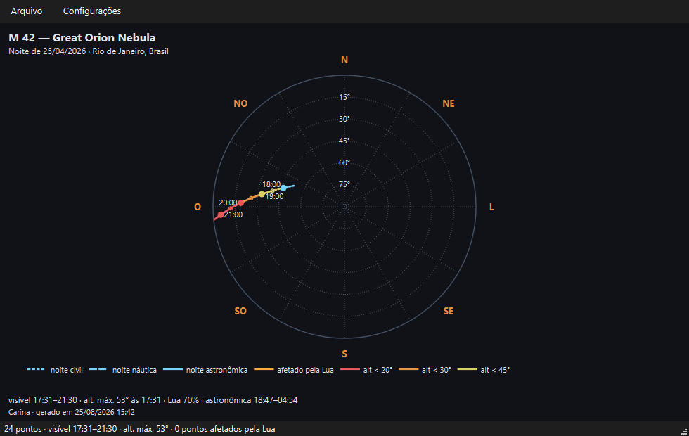

# Observação e astrofotografia

> Carina 0.13.2 — produto em desenvolvimento.

As ferramentas para quem observa com instrumento e para quem fotografa:
enquadramento, influência da Lua, rastreamento e simulação do céu real.

---

## Simulador de enquadramento

`Ctrl+K` ou o botão de campo de visão na barra lateral.

Combine **telescópio + câmera** (ou **ocular**) + **acessório** e o campo
resultante é desenhado sobre o céu, no lugar e no tamanho corretos — do
mesmo modo que o Aladin Lite faz.

### O acervo de fábrica

São 67 equipamentos prontos:

| Categoria | Exemplos |
|---|---|
| **Telescópios** | Newtonianos 130/650 a 200/1000, Dobsons 8"–12", Maksutov 127, SCT C6/C8/C9.25/C11, RASA 8, refratores ED 72–100, Askar FRA400, RedCat 51 |
| **Inteligentes** | **Seestar S50**, **S30** e **S30 Pro** (tubo e sensor casados) |
| **Lentes** | 24 mm, 50 mm e 200 mm fotográficas |
| **Câmeras** | ZWO ASI224, 120, 174, 183, 224, 294, 462, 533, 585, 662, 2600, 6200; DSLR APS-C e full-frame; Micro 4/3 |
| **Oculares** | Plössl 32/25/10 mm, grande campo 14 mm (82°) e 9 mm (66°), ortoscópica 6 mm |
| **Acessórios** | Barlows 1,5× a 4×, redutores 0,5× a 0,8×, flattener, **rotacionador de campo** |
| **Montagens** | EQ3, EQ5/HEQ5, EQ6-R, ZWO AM5, iOptron CEM40, Star Adventurer, AZ-GTi, Dobson |

Você pode acrescentar os seus na aba de gerenciamento; eles ficam
guardados no seu perfil. Ao atualizar o programa, equipamentos novos do
acervo padrão são acrescentados **sem apagar nem duplicar** os seus.

### A ficha técnica

Escolhido o conjunto, o programa calcula:

**Com câmera** (astrofotografia):

- **campo em graus** — `2·atan(sensor / 2f)`;
- **focal efetiva** e razão focal, já com o acessório;
- **escala de placa** em segundos de arco por pixel;
- **amostragem** — se está *subamostrado*, *adequado* ou
  *superamostrado*. É o número que diz se o conjunto resolve o seeing
  típico (~2″) ou desperdiça pixels.

**Com ocular** (visual):

- **ampliação** — focal do telescópio dividida pela da ocular;
- **campo real** — campo aparente dividido pela ampliação;
- **pupila de saída** — abaixo de 0,5 mm a imagem fica escura demais;
  acima de 7 mm você desperdiça abertura;
- **magnitude limite estimada** para a abertura.

### O rotacionador de campo

O controle **Rotação do campo (rotacionador)** gira o retângulo do sensor
de 0° a 359°, para você planejar o enquadramento de um alvo alongado —
uma galáxia de perfil, o Véu, a Nebulosa da Chama.

> Em montagens **altazimutais** há rotação de campo natural em exposições
> longas; o programa avisa disso na ficha. Em equatoriais, o
> enquadramento se mantém.

### Exemplo verificado

Seestar S50 (50 mm de abertura, 250 mm de focal) com o sensor IMX462:
**1,28° × 0,72°** — exatamente o campo divulgado pelo fabricante.

---

## Zona de influência da Lua

Tecla `U`.

Desenha dois anéis em torno da Lua:

- **interno** — a zona crítica, onde o brilho lunar realmente estraga a
  foto;
- **externo** — a zona de cautela.

O raio **cresce com a fase**: de cerca de 10° numa Lua fina a 50° na
cheia. Uma Lua cheia lava o céu a dezenas de graus de distância.

Use junto com o planejamento: os objetos dentro da zona aparecem
**marcados em laranja** nos roteiros.

---

## Rastreamento noturno

`Ctrl+R` com um objeto selecionado.

Uma **carta polar do céu**: o zênite no centro, o horizonte na borda, os
pontos cardeais em volta. A trajetória do objeto durante a noite é
desenhada com informação em cada traço:

### O que a linha conta

| Estilo | Significado |
|---|---|
| **Pontilhado** | Crepúsculo civil — céu ainda claro |
| **Tracejado** | Crepúsculo náutico |
| **Contínuo** | Noite astronômica — céu escuro |

E as **cores** dizem a qualidade da posição:

| Cor | Situação |
|---|---|
| Azul claro | Boa altitude, sem Lua por perto |
| Laranja | Afetado pela Lua |
| Amarelo | Abaixo de 45° |
| Laranja escuro | Abaixo de 30° |
| Vermelho | Abaixo de 20° — massa de ar alta demais |

Os limiares e todas as cores são configuráveis.

### Marcadores de hora

Pontos ao longo da trajetória a cada 30 minutos, com o **horário
rotulado** a cada hora. Eles caem em minutos redondos — 18:00, 18:30,
19:00 — para você conferir contra o relógio no campo.

### Configurações

Menu **Configurações** da própria janela:

- **cores** de cada situação e os **limiares** de altitude;
- **grade**: linhas de altitude e azimute, com o passo, e os cardeais;
- **marcadores** a cada 15, 30 ou 60 minutos; **horários** a cada 30, 60
  ou 120;
- **orientação**: bússola (leste à direita) ou vista do céu (leste à
  esquerda, como um planisfério erguido sobre a cabeça);
- **tema** claro ou escuro, e exibição do ano nas datas;
- **tamanho da fonte** — de 0,6× a 2,5×, para leitura no escuro ou para
  impressão em cartaz;
- **legenda**: exibir ou ocultar, e posicionar abaixo, acima, à esquerda
  ou à direita da carta.

### Exportação

*Arquivo → Exportar* em **PNG**, **JPG**, **PDF** ou **SVG**. A imagem
sai **quadrada** — a carta é redonda, e faixas laterais vazias seriam
desperdício. O PDF sai em retrato, com a carta centrada na página.

O rodapé traz o resumo: horário de visibilidade, altitude máxima e
quando ela ocorre, fase da Lua e os limites da noite astronômica.

---

## Simulando o seu céu

### Poluição luminosa

*Exibir → Poluição luminosa (Bortle)*. Antes de planejar uma noite,
ajuste para a sua realidade — o programa passa a mostrar **o que você
vai realmente enxergar**, e não um céu ideal que não existe no seu
quintal.

Isso muda os roteiros também: objetos que somem no seu Bortle continuam
listados (a lista é do céu, não do seu olho), mas você vê na tela que
não vale a pena tentar sem instrumento.

### Magnitude limite manual

*Exibir → Magnitude máxima das estrelas* impõe um **teto** ao filtro
automático. Serve para simular um instrumento: um binóculo 10×50 alcança
cerca de magnitude 9,5; um telescópio de 8 polegadas, perto de 13.

Lembre que é um teto, não um piso: em campo aberto o programa continua
mostrando menos estrelas que o teto, porque é isso que a escala permite
distinguir.

### Refração e atmosfera

Deixe **ambas ligadas** para planejamento realista. A refração eleva os
astros perto do horizonte — o que muda os horários de nascer e pôr — e a
atmosfera mostra quando o céu ainda está claro demais.

---

## Fluxo sugerido para uma sessão de astrofoto

1. **Localização** (`Ctrl+L`) e **Bortle** conferidos.
2. **Previsão da Lua** (*Ferramentas → Previsão da Lua*): veja em que
   noites do mês ela atrapalha menos.
3. Escolha a data e ative a **zona de influência da Lua** (`U`).
4. **Rastreie o alvo** (`Ctrl+R`): confirme que ele sobe alto o
   suficiente e por quantas horas.
5. **Enquadre** (`Ctrl+K`): monte o conjunto e gire o rotacionador até a
   composição desejada.
6. **Exporte** a carta de rastreamento e a vista enquadrada para levar.
