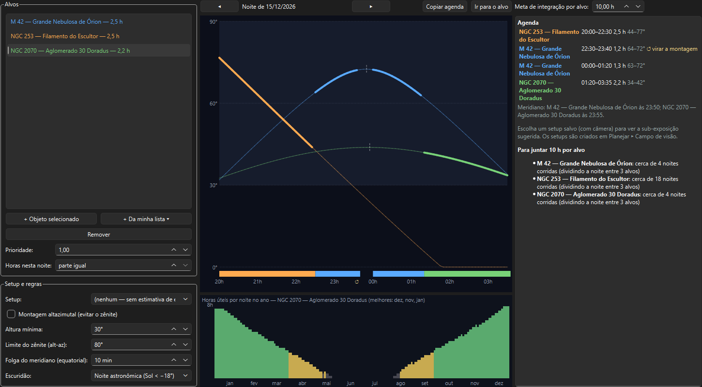
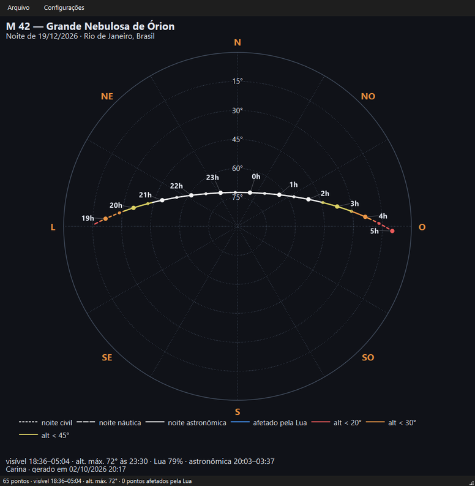

# Observação e astrofotografia

> Carina 0.19.1 — produto em desenvolvimento.

As ferramentas para quem observa com instrumento e para quem fotografa: o
equipamento e o campo, a sessão da noite, a exposição, as horas de
integração, a influência da Lua e o céu real do seu local.

---

## Equipamento e campo de visão

`Ctrl+K` ou *Planejar → Campo de visão*.

Combine **telescópio + câmera** (ou **ocular**) + **acessório** e o campo
resultante é desenhado sobre o céu, no lugar e no tamanho corretos.

### O acervo de fábrica

São 67 equipamentos prontos:

| Categoria | Exemplos |
|---|---|
| **Telescópios** | Newtonianos 130/650 a 200/1000, Dobsons 8"–12", Maksutov 127, SCT C6/C8/C9.25/C11, RASA 8, refratores ED 72–100, Askar FRA400, RedCat 51 |
| **Inteligentes** | **Seestar S50**, **S30** e **S30 Pro** (tubo e sensor casados) |
| **Lentes** | 24 mm, 50 mm e 200 mm fotográficas |
| **Câmeras** | ZWO ASI224, 120, 174, 183, 224, 294, 462, 533, 585, 662, 2600, 6200; DSLR APS-C e full-frame; Micro 4/3 |
| **Oculares** | Plössl 32/25/10 mm, grande campo 14 mm (82°) e 9 mm (66°), ortoscópica 6 mm |
| **Acessórios** | Barlows 1,5× a 4×, redutores 0,5× a 0,8×, flattener, **rotacionador de campo** |
| **Montagens** | EQ3, EQ5/HEQ5, EQ6-R, ZWO AM5, iOptron CEM40, Star Adventurer, AZ-GTi, Dobson, telescópio inteligente (Alt-Az ou EQ) |

Acrescente os seus na aba **Equipamentos**; ao atualizar o programa, os
itens novos do acervo de fábrica entram **sem apagar nem duplicar** os seus.

### Setups salvos

Monte o conjunto e clique em **Salvar como…**: "Seestar no quintal",
"80ED + 533 no sítio". O setup escolhido vira o **setup ativo** — é ele que
a ficha usa para dizer se o objeto cabe no campo e que a sessão de
astrofoto usa para a exposição. **Salvar** grava por cima do setup
escolhido, sem perguntar o nome. Mesmo sem salvar, a janela volta ao último
conjunto usado da próxima vez.

**Telescópios inteligentes** (Seestar e parecidos) têm duas montagens no
acervo: **modo Alt-Az**, o normal, com subs curtas e a zona do zênite a
evitar; e **modo EQ**, com o aparelho inclinado numa cunha apontada para o
polo — sem rotação de campo e sem virar no meridiano. Um setup de Seestar
sem montagem escolhida é tratado como Alt-Az.

### Mosaico

Em **Mosaico (câmera)**, escolha colunas × linhas e a sobreposição: os
painéis aparecem no céu, e a ficha técnica diz a área total coberta. É o
jeito de planejar M 31 num Seestar ou a Grande Nuvem de Magalhães numa lente
de 200 mm.

### Cabe no meu campo?

Com um setup ativo, a ficha de cada objeto de céu profundo responde: *"No
setup Quintal: cabe no quadro (ocupa 23% da área)"* ou *"não cabe — mosaico
de 2 × 2 painéis"*.

### A ficha técnica

**Com câmera** (astrofotografia):

- **campo em graus** — `2·atan(sensor / 2f)`;
- **focal efetiva** e razão focal, já com o acessório;
- **escala de placa** em segundos de arco por pixel;
- **amostragem** — *subamostrado*, *adequado* ou *superamostrado* para o
  seeing típico (~2″).

**Com ocular** (visual):

- **ampliação**, **campo real**, **pupila de saída** (entre 0,5 e 7 mm) e
  **magnitude limite estimada**;
- **imagem na ocular**: como no céu, girada 180° (refletor ou SCT sem
  diagonal) ou espelhada (refrator ou SCT com diagonal). O círculo no céu
  ganha as marcas **N** e **L** onde o norte e o leste aparecem *na ocular*
  — o que poupa muita confusão ao procurar um objeto.

### O rotacionador de campo

O controle **Rotação do campo** gira o retângulo do sensor de 0° a 359°,
para enquadrar um alvo alongado — uma galáxia de perfil, o Véu, a Chama.

> Em montagens **altazimutais** há rotação de campo em exposições longas;
> a ficha avisa. Em equatoriais, o enquadramento se mantém.

**Exemplo verificado:** Seestar S50 (250 mm de focal) com o sensor IMX462 dá
**1,28° × 0,72°** — exatamente o campo divulgado pelo fabricante.

---

## Sessão de astrofoto

*Planejar → Sessão de astrofoto…* (`Ctrl+Shift+S`).

Diferente do roteiro visual (minutos por objeto), aqui cada alvo recebe
**horas de integração** na noite escura. Acrescente os alvos — o objeto
selecionado no mapa, uma das suas listas, as **sugestões** ou, no mapa, o
**botão direito → 📷 Adicionar à sessão de astrofotografia** —, escolha o
**setup** e o Carina divide a noite:

- cada alvo fica com uma **cota** (partes iguais, ou as horas que você
  pedir) e a **prioridade** desempata;
- a montagem fica num alvo até a cota acabar ou ele deixar de ser
  utilizável; o próximo é o mais alto, preferindo quem vai se pôr primeiro;
- blocos menores que 30 minutos não valem a pena e viram folga.

E respeita o que a montagem permite:

| Montagem | Regra |
|---|---|
| **Equatorial alemã** | Nenhum bloco atravessa o **meridiano**. O bloco termina antes, e a agenda marca **↺ virar a montagem** (*meridian flip*), com uma folga configurável |
| **Altazimutal** (Dobson motorizado, AZ-GTi) e **telescópio inteligente em Alt-Az** | A agenda evita a **zona do zênite** (acima de 80°, ajustável), onde a rotação de campo dispara |
| **Telescópio inteligente em modo EQ** (na cunha) | Acompanha como uma equatorial de garfo: sem flip e sem zona do zênite |

A montagem vem do setup; dá para trocar na lista **Montagem** para comparar.
A lista de setups acompanha o que você salva no Campo de visão, e o botão
**Campo de visão…** ao lado abre o simulador para criar ou editar um.

A linha do tempo mostra a altura de cada alvo, os blocos em cores, o
meridiano de cada um e a zona do zênite. **Copiar agenda** leva a agenda
como texto; ela também vai para o [celular](CELULAR.md).

### Exposição sugerida

Com um setup que tenha câmera, a sessão sugere a **duração das subs**: longa
o bastante para o ruído do fundo de céu cobrir o ruído de leitura da câmera,
calculado com a abertura, a escala de placa, a eficiência da câmera e o
**brilho do céu do seu Bortle**. Em montagem altazimutal o limite é de 30 s
(rotação de campo); num telescópio inteligente em modo EQ, 60 s; em focal
longa, 5 min (guiagem). Bortle 8 pede subs bem mais curtas que Bortle 3 — e,
abaixo de 5 s, o programa sugere um filtro.

> É uma ordem de grandeza para começar: faça uma sub de teste e confira o
> histograma — o pico do fundo deve sair da borda esquerda.

### Quantas subs?

Em **Sub-exposição**, escolha a duração das subs (ou **Sugerida**, a da
seção anterior). O painel da direita mostra:

- **nesta noite**: quantas subs cabem no bloco de cada alvo e quantas devem
  sobrar boas;
- **para a meta** (10 h, por exemplo): quantas subs aproveitáveis são
  necessárias e quantas fotografar, com a **margem de perda**.

A margem cobre as subs estragadas por vento, nuvens, satélites ou guiagem,
e cresce com a duração da sub — uma rajada estraga a sub inteira. O padrão:

| Sub | Margem |
|---|---|
| até 60 s | 10% |
| 61 a 120 s | 15% |
| 121 a 180 s | 20% |
| 181 a 300 s | 25% |
| acima de 300 s | 30% |

**Margens…** abre a tabela para mudar os valores e acrescentar faixas
(**+ Faixa**); a última vale para tudo acima. **Padrão** volta à tabela de
fábrica.

### Quantas noites?

Defina a **meta de integração** por alvo (10 h, por exemplo): para cada um,
o Carina soma as horas úteis das próximas noites — já descontando a Lua,
dividindo a noite entre os alvos e tirando a margem de perda — e diz quantas
noites corridas são necessárias.

### Sugestões de alvos

**✨ Sugestões de alvos…** abre as fotos dos objetos mais bem posicionados na
noite da sessão: os que ficam mais horas acima da altura mínima, no escuro,
longe da Lua e fora do horizonte do quintal, com peso para os maiores e mais
brilhantes. Cada foto diz as horas boas, a altura máxima e, com um setup de
câmera, se o objeto **cabe no campo** ou pede mosaico. Filtre por tipo ou
pelos que cabem no campo, clique nas fotos que quiser e **Adicionar à
sessão**.

### Calendário de imageabilidade

Embaixo da linha do tempo, o gráfico do alvo selecionado: **horas úteis por
noite ao longo do ano** (acima da altura mínima, no escuro, longe da Lua
cheia e fora do horizonte do quintal). Os três melhores meses vêm no título.
As linhas horizontais marcam cada hora; passe o mouse sobre uma barra para
ver a data e as horas úteis daquela noite. M 42, do Rio, rende muito mais em
dezembro do que em junho.

---

## Minha foto no mapa

*Arquivo → Minha foto no mapa…*

Sobreponha uma foto sua ao céu do Carina:

1. **Abrir foto…**;
2. clique numa estrela da foto e escolha o nome dela (ou **Usar a estrela
   selecionada no mapa**);
3. faça o mesmo com uma segunda estrela, longe da primeira;
4. **Alinhar e mostrar no céu**.

A foto aparece no lugar, na escala e na rotação certos, com **opacidade**
ajustável; a janela informa a escala (″/pixel) e a orientação da foto. Se a
foto foi feita por uma diagonal (imagem espelhada), marque **Foto
espelhada**. A foto alinhada volta na próxima vez que você abrir o programa.

Bom para conferir um enquadramento, identificar o que saiu no canto da foto
ou comparar a sua imagem com o mapa.

---

## Zona de influência da Lua

Tecla `U`. Dois anéis em torno da Lua — **interno**, onde o brilho lunar
estraga a foto, e **externo**, de cautela. O raio cresce com a fase: de
cerca de 10° numa Lua fina a 50° na cheia. A sessão de astrofoto e o
calendário de imageabilidade já levam a Lua em conta.

---

## Rastreamento noturno

`Ctrl+R` com um objeto selecionado.

Uma **carta polar do céu** com a trajetória do objeto na noite:

| Estilo | Significado |
|---|---|
| **Pontilhado** | Crepúsculo civil |
| **Tracejado** | Crepúsculo náutico |
| **Contínuo** | Noite astronômica |

| Cor | Situação |
|---|---|
| Branco | Boa altitude, sem Lua por perto |
| Azul | Afetado pela Lua |
| Amarelo | Abaixo de 45° |
| Laranja escuro | Abaixo de 30° |
| Vermelho | Abaixo de 20° |

Pontos a cada 30 minutos e o horário em cada hora cheia, em negrito com
contorno, afastado da linha. A janela abre com a altura da tela, na vista do
céu, e tudo o que você muda em **Configurações** (cores, limiares, grade,
marcadores, orientação, tema, fonte, legenda) fica salvo.
*Arquivo → Exportar* em PNG, JPG, PDF ou SVG.

---

## O céu do seu local

### Bortle automático

Ao escolher a cidade (no assistente de primeiro uso ou em *Local →
Localização*), o Carina mostra o **brilho estimado do céu** naquele ponto,
em mag/arcsec² — a escala dos medidores SQM — e a classe de Bortle
correspondente, com a opção de usá-la.

A estimativa vem do mapa de luzes noturnas da NASA (Black Marble 2016,
satélite VIIRS) com um modelo de espalhamento da luz pela atmosfera e
calibração em locais conhecidos. O erro típico é de meia classe a uma
classe: o seu quintal depende dos postes da rua, das árvores e da direção da
cidade mais próxima, então a escolha final continua sendo sua.

### Poluição luminosa

*Exibir → Céu → Poluição luminosa (Bortle)*. Com o Bortle certo o programa
mostra **o que você vai realmente enxergar**, e a nota de cada objeto e a
exposição sugerida passam a usar esse céu.

### Magnitude limite manual

*Exibir → Céu → Magnitude máxima das estrelas* impõe um **teto** ao filtro
automático — para simular um instrumento: um binóculo 10×50 alcança cerca de
magnitude 9,5; um telescópio de 8 polegadas, perto de 13.

### Refração e atmosfera

Deixe **ambas ligadas** para planejar: a refração eleva os astros perto do
horizonte (muda nascer e ocaso) e a atmosfera mostra quando o céu ainda está
claro demais. Sem atmosfera, o céu é desenhado como Bortle 1.

---

## Fluxo sugerido para uma noite de astrofoto

1. **Local** (`Ctrl+L`) e **Bortle** conferidos — use a estimativa do mapa.
2. **Setup** salvo em *Planejar → Campo de visão*, com o mosaico, se for o caso.
3. **Calendário do céu** e **noites escuras**: escolha a noite sem Lua.
4. **Sessão de astrofoto** (`Ctrl+Shift+S`): alvos, agenda, flip, subs.
5. **Companheiro no celular**: leve a agenda para o lado do telescópio.
6. Depois, **Minha foto no mapa** para conferir o enquadramento obtido.
