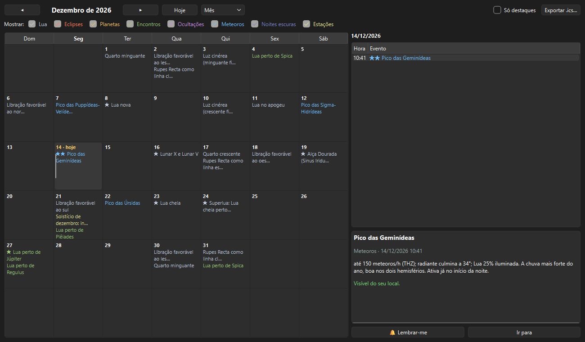

# Calendário do céu

> Carina 0.20.1 — produto em desenvolvimento.

Tudo o que vale anotar na agenda de quem observa, calculado para o **seu
local**: fases e eventos da Lua, eclipses, planetas, encontros, ocultações,
chuvas de meteoros, noites escuras e estações.

*Planejar → Calendário do céu…* (`Ctrl+Shift+A`).

---

## A janela

- **◀ ▶** trocam o mês; **Hoje** volta ao mês atual.
- **Mês** mostra a grade; **Ano (lista)** mostra o ano inteiro, mês a mês
  (calcular o ano leva alguns segundos).
- **Mostrar** liga e desliga as categorias. A escolha fica salva.
- **Só destaques** esconde os eventos menores.
- Clique num dia para ver os eventos dele à direita; clique num evento para
  ler o detalhe.

As estrelas marcam a importância: **★** destaque, **★★** imperdível — por
exemplo, um eclipse visível do seu local ou o pico das Geminídeas com a Lua
fraca.

### Botões do evento

- **🔔 Lembrar-me** — guarda um lembrete. Ao abrir o programa no dia do
  evento ou na véspera, o cartão **Hoje no céu** avisa. Os lembretes antigos
  são apagados sozinhos.
- **Ir para** — leva o céu ao instante do evento e, quando faz sentido,
  aponta para o astro.

---

## As categorias

| Categoria | Eventos |
|---|---|
| **Lua** | Fases; perigeu e apogeu (superlua); libração favorável; Lunar X; Alça Dourada; Rupes Recta; luz cinérea — ver [A Lua](LUA.md) |
| **Eclipses** | Do Sol e da Lua, com a altura do astro no máximo e se são visíveis daqui |
| **Planetas** | Oposições, conjunções com o Sol e maiores elongações de Mercúrio e Vênus |
| **Encontros** | Lua perto de planetas (até 4°) e de estrelas brilhantes perto da eclíptica (Aldebaran, Regulus, Spica, Antares, Pollux, Plêiades); planetas perto entre si |
| **Ocultações** | Estrelas até magnitude 4,5 e planetas escondidos pela Lua, só as visíveis do local |
| **Meteoros** | O pico de 25 chuvas da lista da IMO, com a taxa horária zenital (THZ), a altura do radiante no seu local e a Lua na noite do pico |
| **Noites escuras** | Noites com mais de 8 horas de noite astronômica sem a Lua, agrupadas quando seguidas |
| **Estações** | Equinócios e solstícios, com o nome da estação no seu hemisfério |

> **Meteoros no hemisfério sul.** O calendário diz se o radiante sobe no
> seu local. As Úrsidas, por exemplo, não aparecem no Brasil; as
> Eta-Aquarídeas e as Delta-Aquarídeas do Sul são melhores aqui do que no
> hemisfério norte.

---

## Levar para o celular

**Exportar .ics…** grava os eventos visíveis (com os filtros aplicados) num
arquivo iCalendar. Google Agenda, Outlook, o calendário do iPhone e o do
Android importam esse formato:

- **Google Agenda**: *Configurações → Importar e exportar → Importar*;
- **Outlook**: abrir o arquivo com duplo clique;
- **celular**: envie o arquivo para você mesmo e abra o anexo.

Os eventos com lembrete ativo vão com um aviso uma hora antes.

---

## Hoje no céu

Ao abrir o programa, um cartão lista os destaques do dia e os seus
lembretes próximos — só quando há algo a mostrar. Desmarque **Mostrar ao
abrir o programa** para não vê-lo mais; o Calendário continua no menu.
