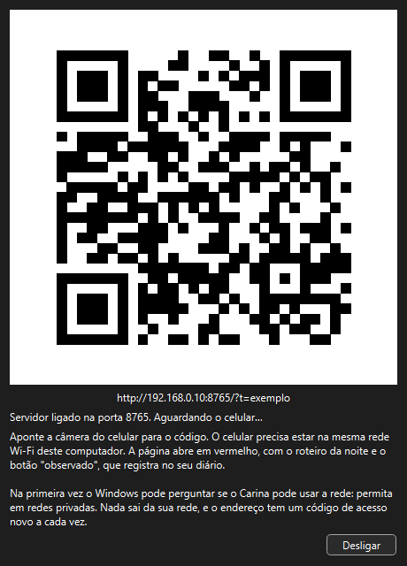

# Companheiro no celular

> Carina 0.21.0 — produto em desenvolvimento.

Leve o roteiro da noite para o lado do telescópio: o celular mostra a lista
em **vermelho** (para não perder a adaptação ao escuro) e cada **observado**
que você marca vai para o diário do computador.

&nbsp;&nbsp;

---

## Como usar

1. Deixe o computador e o celular na **mesma rede Wi-Fi**.
2. *Planejar → Companheiro no celular…* — o servidor liga e aparece um QR code.
3. Aponte a câmera do celular para o código e abra o endereço.
4. Abaixe o brilho do celular. Pronto.

Na primeira vez, o Windows pode perguntar se o Carina pode usar a rede:
**permita em redes privadas** (a rede de casa). Em redes públicas, como a de
um hotel, o celular pode não conseguir se conectar.

## O que aparece no celular

O celular mostra, nesta ordem de preferência:

1. o **roteiro aberto** (uma maratona, os melhores da noite, o roteiro da
   sua lista) — com horário, tipo, constelação, altura e como encontrar;
2. a **sessão de astrofoto** aberta — os blocos de cada alvo e o aviso de
   virar a montagem;
3. sem nenhum dos dois, os **melhores alvos de hoje à noite** e os planetas.

A página se atualiza sozinha a cada minuto. Toque em **observado** e o
registro entra no diário do computador, com o local, o Bortle e a nota
"registrado pelo celular" — dá para completar depois no *Diário* (`Ctrl+Shift+J`).

## Segurança

- O servidor só existe enquanto a janela do companheiro está aberta.
- O endereço leva um **código de acesso** novo a cada vez que você liga o
  companheiro; sem ele, nada é mostrado.
- Tudo fica na sua rede: o Carina não acessa a internet para isso, e a
  página não carrega nada de fora.

## Se não conectar

| Sintoma | O que fazer |
|---|---|
| "Não foi possível abrir a página" | Confira se os dois estão na mesma rede Wi-Fi (não no 4G/5G) |
| Página não carrega em rede de hotel ou café | Essas redes isolam os aparelhos; use o roteador do celular (ponto de acesso) e conecte o computador nele |
| O Windows bloqueou | *Firewall do Windows → Permitir um aplicativo* e marque o Carina em redes privadas |
| O endereço mudou | O código de acesso é novo a cada vez: escaneie o QR de novo |
