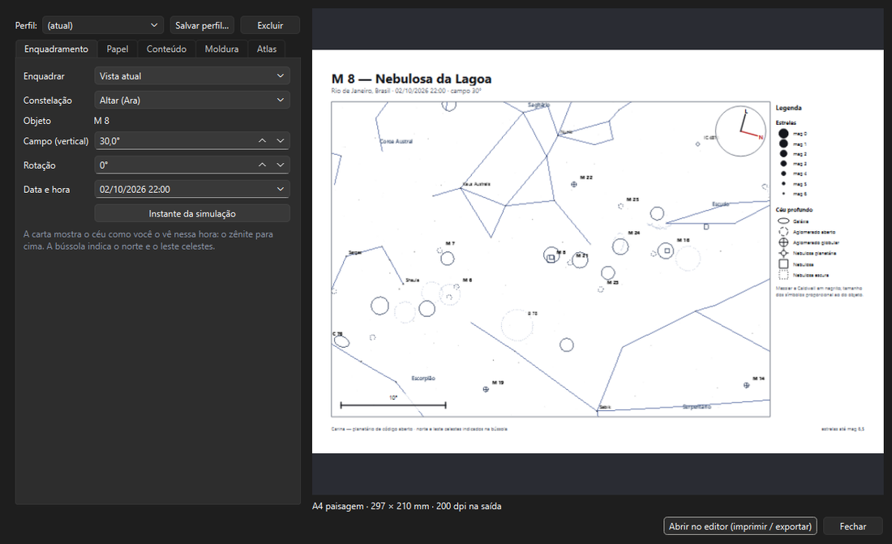
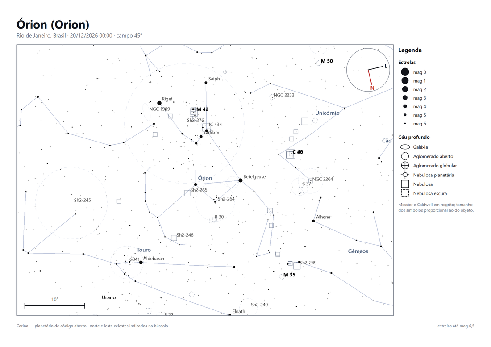
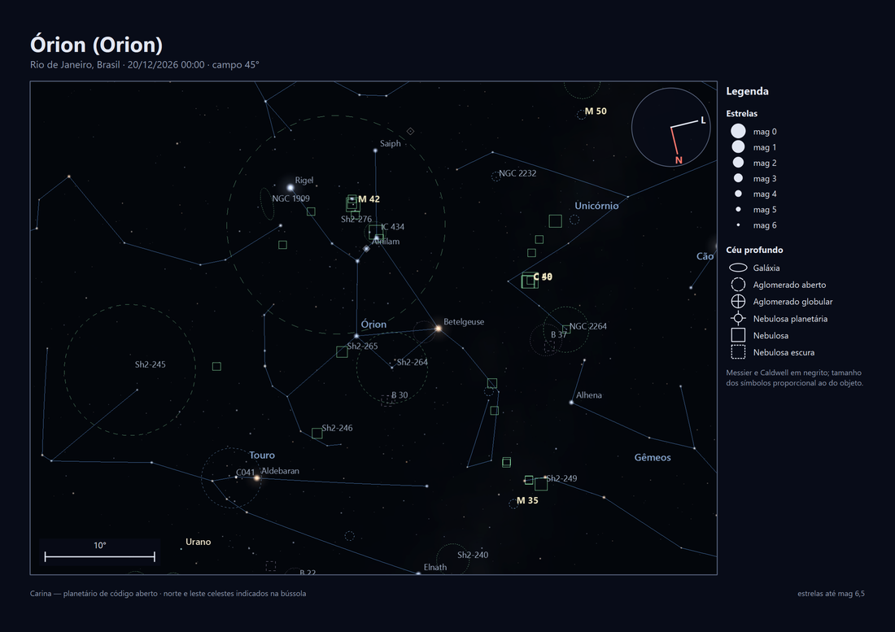

# Impressão e cartas celestes

> Carina 0.18.0 — produto em desenvolvimento.

Tudo o que o Carina desenha pode sair da tela: em imagem, em PDF ou em
papel. Desde a 0.16, as cartas são desenhadas **fora da tela**, em alta
resolução e com opções próprias — a vista que você está usando não muda.

---

## Gerador de carta celeste

*Arquivo → Gerar carta celeste…* (`Ctrl+Shift+P`) ou o botão **Imprimir**
da barra lateral.

À esquerda ficam as opções, em cinco abas; à direita, a **pré-visualização**
da página inteira, que se atualiza a cada mudança.

### Enquadramento

| Opção | O que faz |
|---|---|
| **Vista atual** | A direção e o campo que estão na tela |
| **Objeto selecionado** | Centraliza o objeto (ou o que estiver selecionado ao abrir) |
| **Constelação inteira** | Escolha na lista: o campo se ajusta às fronteiras oficiais da IAU |
| **Campo do equipamento** | Centraliza a seleção e desenha o campo do simulador de enquadramento |
| **Campo** | Altura do mapa em graus |
| **Rotação** | Gira o mapa na página (os cantos são preenchidos) |
| **Data e hora** | O instante da carta; o botão traz o da simulação |

A carta mostra o céu como você o vê naquela hora, com o zênite para cima.
A **bússola** da moldura indica o norte e o leste **celestes** no centro
do mapa — do hemisfério sul, Órion aparece "de cabeça para baixo" em
relação aos atlas do norte, e a bússola deixa isso claro.

### Papel

**A4**, **A3** ou **Carta**, em paisagem ou retrato, com margens e
resolução de saída (100 a 400 dpi; 200 dpi é ótimo para impressora
doméstica).

### Conteúdo

- **Tema**: *Claro (papel)* — estrelas como discos pretos, pronto para
  imprimir; *Escuro (Carina)* — o visual da tela, bom para tablet;
  *Vermelho* — para consultar no campo sem perder a visão noturna.
- **Estrelas até a magnitude** — valor exato, sem o ajuste automático pelo
  zoom da tela.
- **Nomes de estrelas até** — só os nomes das mais brilhantes, ou mais.
- **Céu profundo** com um filtro próprio (os mesmos modelos do filtro de
  exibição: Padrão, Binóculo, Só Messier e Caldwell…), rótulos por
  designação ou por nome.
- Caixas para linhas e fronteiras das constelações, seus nomes, grades
  equatorial e horizontal, eclíptica, equador, meridiano, solo, Via
  Láctea, imagens do levantamento, planetas, pontos cardeais, campo do
  equipamento e marcador da seleção.

### Moldura

Título e subtítulo (vazio = local, data e campo automáticos), **bússola**,
**escala angular**, **legenda** (magnitudes das estrelas e símbolos do céu
profundo) e rodapé. Cada item liga e desliga.

### Perfis

**Salvar perfil…** guarda o estilo da carta — papel, tema, conteúdo e
moldura, não o alvo — com um nome ("A4 para imprimir", "Tablet escuro").
Escolha o perfil na lista para reaplicá-lo.

### Atlas

A aba **Atlas** gera várias páginas de uma vez, com o papel, o tema, o
conteúdo e a moldura das outras abas:

| Fonte | Páginas |
|---|---|
| **Paradas do último roteiro aberto** | Uma por parada, na hora agendada dela |
| **Itens da minha lista (★)** | Uma por item, na melhor hora desta noite |
| **Constelações acima de 25° agora** | Uma por constelação, enquadrada inteira |

### Imprimir e exportar

**Abrir no editor** leva a página (ou o atlas) para o editor de anotações.

---

## Editor de anotações

Recebe uma ou várias páginas. Com várias, use `◀` e `▶` (ou `PgUp` e
`PgDn`) para navegar; cada página guarda as próprias anotações.

| Ferramenta | Uso |
|---|---|
| **Selecionar** | Clique numa anotação para movê-la; `Del` apaga |
| **Texto** | Clique e digite — para nomear alvos, anotar horários |
| **Seta** | Arraste da origem ao destino |
| **Linha** | Reta simples |
| **Retângulo** | Delimita uma região |
| **Elipse** | Circunda um objeto ou campo |
| **Desenho livre** | Traço à mão, para contornos e caminhos |

- **Imprimir** envia todas as páginas, no papel escolhido na carta;
- **Exportar PDF** gera um arquivo com todas as páginas, no tamanho exato
  do papel;
- **Exportar PNG** salva a página (num atlas, um arquivo por página);
- **Exportar SVG** salva a página atual, com as anotações vetoriais.

---

## Anotar a vista atual

*Arquivo → Anotar a vista atual…* abre o mesmo editor com uma captura da
tela em modo mapa — o caminho rápido, sem moldura.

## Modo mapa

`Ctrl+M` ou o botão **Mapa** da barra lateral: traços escuros sobre fundo
branco na própria tela, como num atlas impresso. As imagens do
levantamento não são desenhadas.

## Exportar a vista

`Ctrl+S` (*Arquivo → Exportar vista*) salva exatamente o que está na tela,
em PNG, JPG ou PDF.

## PDF dos roteiros

Descrito em [PLANEJAMENTO.md](PLANEJAMENTO.md#levando-para-o-campo): mapa
da noite, checklist e cartas de localização, em tema claro, escuro ou
vermelho.
