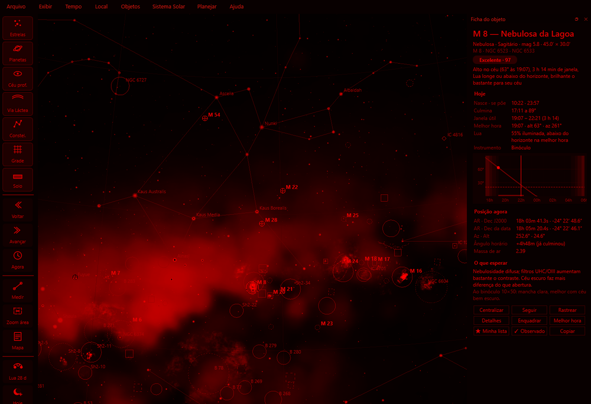
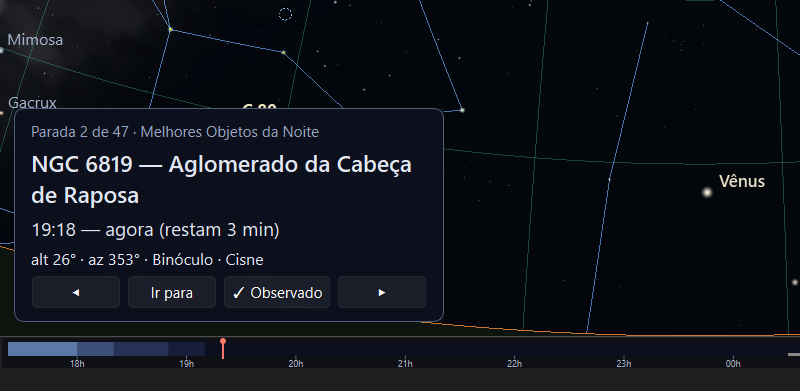
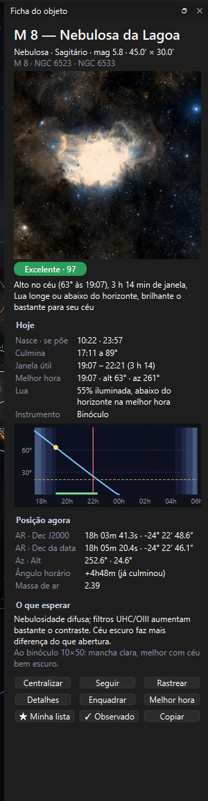

# Referência da interface

> Carina 0.22.0 — produto em desenvolvimento.

Cada menu, botão e painel, com o que faz e o atalho correspondente.

---

## A janela

```
┌──────────────────────────────────────────────────────────┐
│  Arquivo  Exibir  Tempo  Local  Objetos  Sistema Solar  … │ ← menus
├────┬─────────────────────────────────────────┬───────────┤
│ 🔘 │                                          │           │
│ 🔘 │                                          │ Informa-  │
│ 🔘 │              O CÉU                       │  ções     │
│ 🔘 │                                          │ (dock,    │
│ ⋮  │                                          │  opcional)│
├────┴─────────────────────────────────────────┴───────────┤
│  ▓▓▒▒░░  18h  20h  22h  00h  02h  04h  ░░▒▒▓▓             │ ← linha do tempo da noite
│  Rio de Janeiro · 24/08/2026 22:00 · pausado · FOV 30°   │ ← estado
└──────────────────────────────────────────────────────────┘
   ↑ barra lateral
```

---

## Mouse e teclado no céu

| Ação | Resultado |
|---|---|
| **Arrastar** com o botão esquerdo | Gira a vista; o ponto sob o cursor acompanha o cursor |
| **Roda** do mouse | Aproxima e afasta **ancorado no ponto sob o cursor** (campo de 0,25° a 100°) |
| **Clique** | Seleciona o objeto — ou o rótulo — mais próximo |
| **Duplo clique** | Centraliza o ponto do céu sob o cursor, com animação |
| **Pairar** o mouse | Tooltip com nome, magnitude e altitude do objeto |
| **Clique direito** | Menu de contexto do objeto, ou do céu vazio |
| **Setas** ← → ↑ ↓ | Deslocam a vista |
| **`+` `−`** (ou `PgUp` `PgDn`) | Aproximam e afastam |
| **`Backspace`** | Volta à vista anterior (as últimas 30 ficam guardadas) |
| **`F`** | Liga e desliga **Seguir objeto**: a câmera acompanha a seleção enquanto o tempo corre (desliga sozinho ao arrastar) |
| **`Esc`** | Cancela a seleção |

O clique tem prioridades: corpos do Sistema Solar primeiro, depois
rótulos, depois estrelas e objetos de céu profundo. Ao centralizar um
objeto que está **abaixo do horizonte**, uma faixa no alto do céu avisa
e diz a hora em que ele nasce.

### Menu do botão direito

**Sobre um objeto**

- **Informações de X** — ficha em janela flutuante, atualizada ao vivo
- **Janela de detalhes…** — imagem grande e gráfico anual de altitude
- **Selecionar e centralizar** · **Seguir X** · **Rastrear na noite…**
- **Ir para a melhor hora desta noite** — salta o relógio para a maior
  altitude dentro da janela útil, já com o seu horizonte (e pausa)
- **Ir para quando nasce** — aparece quando o objeto está sob o horizonte
- **Enquadrar com equipamento…** — abre o simulador de campo centrado nele
- **📷 Adicionar à sessão de astrofotografia** — objetos de céu profundo e
  estrelas; abre a sessão, se preciso, com o objeto já na lista
- **🧭 Tours com este objeto…** — aparece quando algum tour passa pelo objeto
- **★ Acrescentar à minha lista** · **✓ Marcar como observado…**
- **Copiar nome** · **Copiar coordenadas** (AR/Dec J2000 e Az/Alt atuais)

**Sobre o céu vazio**

- **Qual constelação é esta?** — destaca por alguns segundos as linhas e
  a fronteira da constelação sob o cursor e diz o nome
- **Centralizar aqui** · **Zoom aqui** · **Medir a partir daqui**
- **Olhar para** ▸ Norte, Leste, Sul, Oeste, Zênite
- **Camadas** ▸ interruptores rápidos (estrelas, planetas, céu profundo,
  imagens, Via Láctea, linhas, fronteiras, grades, solo)
- **Agora** · **Limpar seleção**

---

## Barra lateral

De cima para baixo (com *Exibir ▸ Rótulos na barra lateral* cada botão
ganha um texto curto embaixo do ícone):

### Camadas (botões que acendem quando ativos)

| Botão | Camada |
|---|---|
| Estrelas | Liga e desliga todas as estrelas |
| Sistema Solar | Sol, Lua e planetas |
| **Céu profundo** | Marcações **e** imagens, juntas (controle mestre) |
| Via Láctea | A textura de fundo |
| Constelações | As linhas das figuras |
| Grade horizontal | Círculos de altitude e azimute |
| **Solo opaco** | Marcado: solo; desmarcado: vê abaixo do horizonte |

> O botão de céu profundo é um **mestre**: apaga marcações e imagens de
> uma vez. No menu *Exibir*, as duas são independentes — dá para ver a
> imagem da nebulosa sem os círculos por cima.

### Tempo

**◀◀** retrocede um passo · **▶▶** avança um passo · **🕐** volta ao agora.
O tamanho do passo sai de *Tempo → Passo dos botões*.

### Ferramentas

| Botão | Função |
|---|---|
| Hoje | Hoje à noite: a noite, a Lua, os melhores alvos e os planetas (`T`) |
| Medir | Clique em dois pontos para medir a separação angular |
| Zoom por área | Arraste um retângulo para enquadrar |
| Modo mapa | Alterna para o esquema de impressão |
| Previsão da Lua | Liga e desliga o caminho lunar de 28 dias |
| Buscar | Abre a busca |
| Rastrear | Rastreamento noturno do objeto selecionado |
| Campo de visão | Simulador de enquadramento |
| Planejar | Escolha rápida de um roteiro |
| Imprimir | Gerador de carta celeste (`Ctrl+Shift+P`) |
| Informações | Crepúsculos e noite |

---

## Barra de menus

Oito menus, agrupados por tarefa. A lista completa de atalhos está em
[ATALHOS.md](ATALHOS.md) e em *Ajuda ▸ Atalhos do teclado e do mouse*.

### Arquivo

| Item | Atalho | O que faz |
|---|---|---|
| Exportar vista… | `Ctrl+S` | Salva a tela atual em PNG, JPG ou PDF |
| Gerar carta celeste… | `Ctrl+Shift+P` | Carta para imprimir com moldura, perfis e atlas ([IMPRESSAO.md](IMPRESSAO.md)) |
| Anotar a vista atual… | | Editor de anotações sobre a tela em modo mapa |
| Relatório da noite… | | PDF com o céu e as observações da noite e cartão PNG para compartilhar ([DIARIO.md](DIARIO.md#relatório-da-noite)) |
| Pôster do céu… | | O céu de uma data com título e frase, A3/A4 ([IMPRESSAO.md](IMPRESSAO.md#pôster-do-céu)) |
| Minha foto no mapa… | | Sobrepõe uma foto sua, alinhada por duas estrelas ([ASTROFOTOGRAFIA.md](ASTROFOTOGRAFIA.md#minha-foto-no-mapa)) |
| Preferências… | `Ctrl+,` | Idioma, fonte da interface, rótulos do céu, instrumento da nota |
| Sair | | Fecha o programa |

### Exibir

Quatro submenus de camadas e os controles gerais da vista.

| Submenu | Conteúdo |
|---|---|
| **Objetos** | Estrelas · Planetas, Sol e Lua (`P`) · Objetos de céu profundo (`D`) · Imagens DSS (`I`) · Via Láctea (`M`) · **Catálogos do céu profundo** (liga e desliga Messier, NGC, IC, Caldwell, Sh2, Barnard, Melotte, LDN, Collinder, vdB e Abell, ou todos de uma vez; um objeto em vários catálogos aparece se algum estiver ligado) |
| **Linhas e grades** | Linhas (`C`) e fronteiras (`B`) das constelações · Grade horizontal (`Z`) · Grade equatorial (`E`) · Meridiano · Eclíptica · Equador · Linha do horizonte (`H`) · Pontos cardeais (`Q`) |
| **Rótulos** | Nomes das estrelas (`N`), dos planetas, das **formações da Lua** e do céu profundo · estrelas por nome próprio ou Bayer · céu profundo por número ou nome · Caldwell pela designação C · **Nomes das constelações** (não exibir, português, latim, abreviado) · **Idioma dos nomes dos objetos** (português, inglês original, latim) |
| **Céu** | Atmosfera (`A`) · Refração (`R`) · Solo opaco (`G`/`V`) · **Poluição luminosa (Bortle)** · **Magnitude máxima das estrelas**. Sem atmosfera não há poluição luminosa: o céu é desenhado como Bortle 1, e o Bortle escolhido volta ao religá-la |

Abaixo dos submenus: **Filtros do céu profundo…** (`Ctrl+Shift+C`, ver
[CATALOGOS.md](CATALOGOS.md)), **Modo mapa para impressão** (`Ctrl+M`),
**Modo noturno (vermelho)** (`Ctrl+N`), **Tela cheia** (`F11`), **Modo
observação** (`Ctrl+Shift+F`), **Linha do tempo da noite**, **Seguir objeto
selecionado** (`F`), **Voltar à vista anterior** (`Backspace`), **Rótulos
na barra lateral** e a exibição dos painéis.

- **Modo noturno** pinta céu e interface inteiros em vermelho escuro, sem
  azul nem verde, para não desfazer a adaptação do olho ao escuro. Fica
  salvo: se você fechar o programa no modo noturno, ele reabre assim.

<div align="center">

</div>

- **Modo observação** é para o lado do telescópio: os painéis somem, os
  rótulos do céu crescem e um cartão mostra o **próximo alvo** do roteiro
  aberto, com cronômetro, altura, direção e instrumento, e botões para ir
  até ele, marcar como observado e andar pelas paradas.

<div align="center">

</div>

- **Linha do tempo da noite** fica no rodapé: do pôr ao nascer do Sol, com
  as cores do crepúsculo e uma faixa clara enquanto a Lua está no céu.
  Clique ou arraste para levar o relógio àquela hora.

### Tempo

| Item | Atalho | O que faz |
|---|---|---|
| Agora | `8` | Volta ao instante presente, em velocidade normal |
| Pausar / continuar | `K` | Congela ou retoma o relógio |
| Mais devagar / Mais rápido | `J` / `L` | Divide ou multiplica a velocidade por 10 |
| Velocidade normal | `7` | Volta a 1× |
| Ir para data/hora… | `Ctrl+T` | Salta para um instante, na **hora do observador** |
| **Ir para ▸** | | Pôr do sol · Início da noite astronômica · Meia-noite local · Fim da noite astronômica · Nascer do sol (pausa no instante) |
| Passo dos botões | | De 1 minuto a 1 ano |
| Retroceder / avançar | `Ctrl+←` `Ctrl+→` | Um passo para trás ou para frente |

### Local

| Item | Atalho | O que faz |
|---|---|---|
| Localização… | `Ctrl+L` | Escolha da cidade (745 embarcadas) e coordenadas |
| Crepúsculos e noite… | `Ctrl+I` | Horários do Sol e das três faixas de crepúsculo, Lua |
| Horizonte do quintal… | | Desenhe a silhueta de prédios e árvores ([PLANEJAMENTO.md](PLANEJAMENTO.md#o-horizonte-do-quintal)) |
| Locais salvos ▸ | | Guarde o local atual (com Bortle e horizonte) e troque com um clique |

### Objetos

| Item | Atalho | O que faz |
|---|---|---|
| Buscar… | `Ctrl+F` | Nomes, designações, Bayer e constelações, com altitude e nota; `Ctrl+Enter` acrescenta à lista |
| Informações do objeto selecionado | `Ctrl+J` | Abre a ficha no painel lateral |
| Detalhes e gráfico anual… | `Ctrl+Shift+D` | Imagem grande e gráfico anual |
| Rastrear na noite… | `Ctrl+R` | Carta polar da trajetória |
| Ir para a melhor hora desta noite | | Salta o relógio para a melhor hora da janela útil |
| Ir para quando nasce | | Salta o relógio para pouco depois do nascer |
| Minhas listas… | `Ctrl+Shift+L` | Listas de alvos com a nota da noite ([DIARIO.md](DIARIO.md)) |
| ★ Acrescentar seleção à minha lista | `Ctrl+B` | Acrescenta o objeto selecionado |
| Diário de observação… | `Ctrl+Shift+J` | Registros, busca e exportação CSV |
| Programas de observação… | `Ctrl+Shift+G` | Messier, Caldwell, Herschel 400… com progresso e certificado ([PROGRAMAS.md](PROGRAMAS.md)) |
| Gerenciar catálogo de céu profundo… | `Ctrl+D` | CRUD completo, categorias, habilitar/desabilitar |

### Sistema Solar

| Item | Atalho | O que faz |
|---|---|---|
| Eclipses… | `Ctrl+E` | Previsão de eclipses solares e lunares |
| Planetas… | `Ctrl+Shift+E` | Janela de planetas: estado, melhor época, luas e eventos ([PLANETAS.md](PLANETAS.md)) |
| A Lua em detalhe… | | Janela do globo lunar ([LUA.md](LUA.md)) |
| Caminho dos planetas (365 dias)… | | Traça a trajetória anual |
| Exibir caminhos dos planetas | `Shift+P` | Mostra ou esconde sem recalcular |
| Limpar caminhos dos planetas | | Descarta os caminhos |
| Previsão da Lua (28 dias)… | | Calcula o caminho lunar |
| Exibir previsão da Lua no céu | `Shift+M` | Mostra ou esconde |
| Zona de influência da Lua | `U` | Anéis onde a Lua clareia o céu (Krisciunas & Schaefer) |
| Caminho do Sol e analema | | O caminho do Sol no dia e o "8" da hora atual |
| Nascer e ocaso do Sol no ano… | | Tabela semana a semana, com o azimute |

### Planejar

| Item | Atalho | O que faz |
|---|---|---|
| Hoje à noite… | `T` | Resumo da noite com os melhores alvos |
| Calendário do céu… | `Ctrl+Shift+A` | Eventos do mês ou do ano, filtros, lembretes e .ics ([CALENDARIO.md](CALENDARIO.md)) |
| Calendário de noites escuras… | `Ctrl+Shift+N` | Horas sem Lua de cada noite do mês; destaca as com mais de 8 h; clique leva à data |
| Sessão de astrofoto… | `Ctrl+Shift+S` | Agenda de integração da noite, exposição e imageabilidade ([ASTROFOTOGRAFIA.md](ASTROFOTOGRAFIA.md#sessão-de-astrofoto)) |
| Companheiro no celular… | | Roteiro no celular pelo QR code ([CELULAR.md](CELULAR.md)) |
| Satélites e ISS… | | Passagens a partir de elementos orbitais importados, trilha no céu |
| Lua ▸ | | **A Lua em detalhe…** (`Ctrl+Shift+M`), **Planejador de foto lunar…** e **Lunar 100…** ([LUA.md](LUA.md)) |
| Roteiros ▸ | | Maratonas, melhores objetos, roteiro da minha lista, destaques ([PLANEJAMENTO.md](PLANEJAMENTO.md)) |
| Campo de visão (equipamentos)… | `Ctrl+K` | Simulador de enquadramento, setups salvos e mosaico |
| Planisfério… | | O disco de estrelas sob a janela do horizonte ([PLANEJAMENTO.md](PLANEJAMENTO.md#planisfério)) |
| Configurar planejamento… | `Ctrl+Shift+O` | Ritmo, janela da noite e altitude mínima |

### Tours

| Item | Atalho | O que faz |
|---|---|---|
| Galeria de tours… | `Ctrl+Shift+T` | Os tours por categoria, com a data do céu ([TOURS.md](TOURS.md)) |
| Iniciantes ▸ · Intermediário ▸ · Astrofotografia ▸ · Extras ▸ | | Começa um tour direto |
| Quiz do céu… | | "Qual constelação é esta?" e "Encontre a estrela" ([TOURS.md](TOURS.md#quiz-do-céu)) |
| Asterismos | `Shift+A` | Mostra os asterismos no céu (o mesmo item de *Exibir ▸ Linhas e grades*) |
| Como funcionam os tours | | Abre a ajuda dos tours |

### Ajuda

| Item | Atalho | O que faz |
|---|---|---|
| Ajuda do Carina | `F1` | Esta documentação, dentro do programa, com índice e busca |
| O que há de novo | | As novidades da versão (abre sozinho depois de uma atualização) |
| Abrir a documentação no navegador | | Os mesmos arquivos, no navegador |
| Assistente de primeiro uso… | | Cidade, céu e instrumento em três passos |
| Atalhos do teclado e do mouse… | `Ctrl+Shift+K` | Tabela pesquisável, lida dos próprios menus |
| Sobre o Carina | | Versão e créditos dos dados |

---

## Painéis e janelas

### Ficha do objeto (direita)

<div align="center">

</div>

A mesma ficha aparece no painel lateral, no popup do botão direito
(*Informações de X*, que pode ficar no topo) e na janela de detalhes:

- **resumo** — nome, tipo, constelação, magnitude, tamanho, designações e
  a imagem do levantamento (céu profundo);
- **nota da noite** — de 0 a 100, com a explicação;
- **Hoje** — nasce, culmina, se põe, janela útil, melhor hora, a Lua, o
  instrumento sugerido e o gráfico da noite;
- **Posição agora** — AR/Dec J2000 e da data, azimute e altitude, ângulo
  horário (subindo ou já culminou) e massa de ar;
- **O que esperar** — ao olho, ao binóculo e ao telescópio; nas estrelas,
  a cor, a distância em anos-luz e o tipo espectral;
- **Seu diário** — quantas vezes você observou, a última nota e as listas
  em que o objeto está;
- **botões** — Centralizar, Seguir, Rastrear, Detalhes, Enquadrar, Melhor
  hora, ★ Minha lista, ✓ Observado, Copiar e **📷 Sessão** (céu profundo e estrelas: acrescenta à sessão de astrofotografia).

Abra com `Ctrl+J` ou clicando num objeto.

### Janela de detalhes

Imagem grande, a ficha completa e o **gráfico de altitude ao longo do
ano**, amostrado a cada dez dias, com duas curvas:

- **laranja** — a altitude no meio da noite astronômica. O pico é a
  melhor época do ano para o objeto;
- **azul** — a altitude máxima que ele alcança naquela noite.

Passe o mouse sobre o gráfico para ler a data e as altitudes.

### Janela de planejamento

Tabela do roteiro, painel com carta e gráfico, linha do tempo arrastável e
filtros. Descrição completa em
[PLANEJAMENTO.md](PLANEJAMENTO.md#a-janela-de-planejamento).

### Hoje à noite, Minhas listas, Diário e Calendário

Ver [PLANEJAMENTO.md](PLANEJAMENTO.md) e [DIARIO.md](DIARIO.md).

### Janela de planetas

Ver [PLANETAS.md](PLANETAS.md).

### A Lua em detalhe, planejador lunar e Lunar 100

Ver [LUA.md](LUA.md).

### Calendário do céu e "Hoje no céu"

Ver [CALENDARIO.md](CALENDARIO.md).

### Janela de rastreamento

Carta polar do céu — zênite no centro, horizonte na borda — com a
trajetória da noite. Ver [ASTROFOTOGRAFIA.md](ASTROFOTOGRAFIA.md).

---

## Barra de estado

Da esquerda para a direita: **local**, **data e hora do observador** com a
**velocidade do tempo** (ou "pausado"), **campo de visão** e, quando o
cursor está sobre o céu, o **azimute e a altitude** sob ele. Três campos
são clicáveis: o local abre *Localização*, a hora abre *Ir para
data/hora* e o campo de visão volta a 90°. Avisos temporários
(exportações, "objeto abaixo do horizonte, nasce às…") aparecem à
esquerda.
