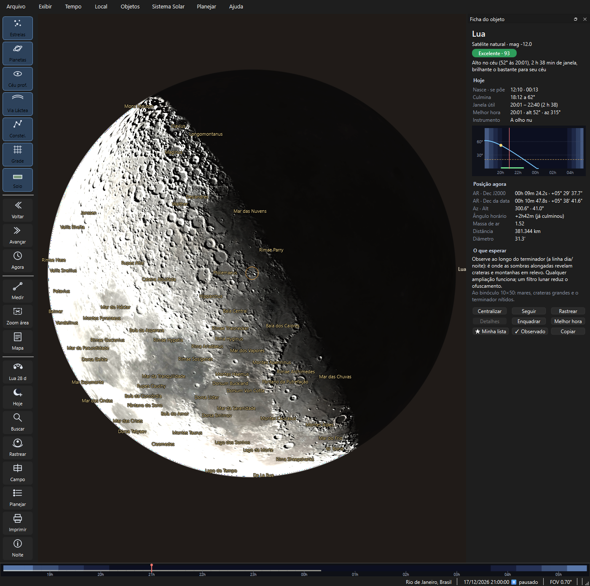
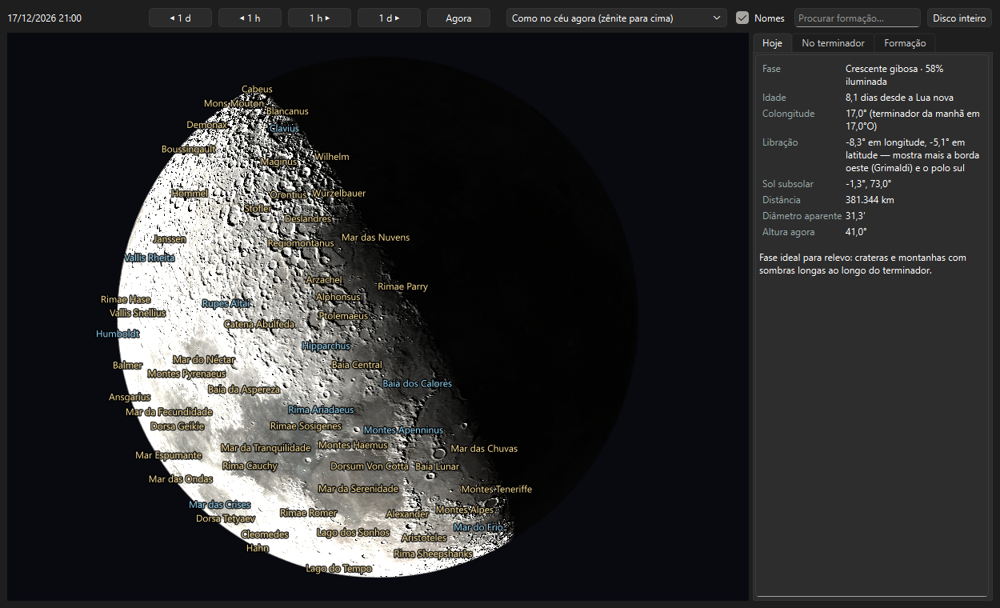
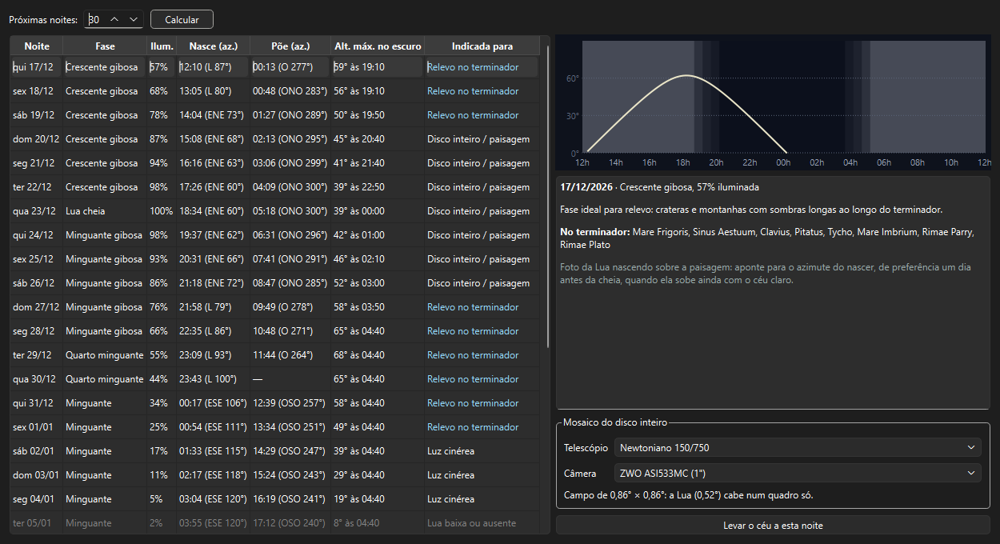
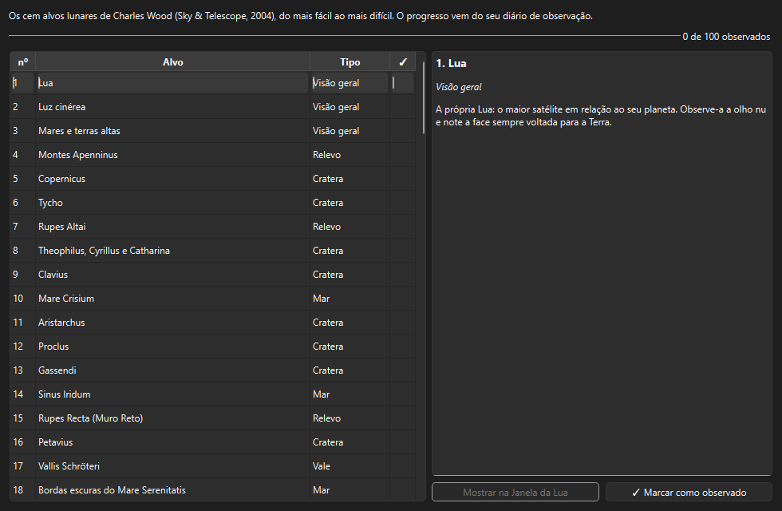

# A Lua

> Carina 0.21.0 — produto em desenvolvimento.

A Lua é o primeiro alvo de quase todo mundo e continua interessante pela
vida inteira: a cada noite o Sol nasce sobre outras crateras, e o relevo
que aparece no terminador muda de hora em hora. O Carina mostra a Lua como
ela está de fato, diz o que vale olhar hoje e ajuda a planejar a foto.

---

## No céu

Aproxime a Lua (`Ctrl+F` → *Lua*, depois a roda do mouse). Abaixo de
alguns graus de campo, o disco vira um **globo com relevo**:

- **a fase e o terminador** saem da posição real do Sol: as crateras perto
  da linha dia/noite projetam sombras;
- **a libração** está incluída — a Lua balança um pouco e mostra ora mais
  da borda leste, ora da oeste, ora de um polo. O globo aparece com a face
  exata daquela noite;
- **a luz cinérea** clareia a parte escura nas fases finas, como você vê
  logo depois do pôr do Sol;
- **os nomes das formações** aparecem quando a Lua ocupa boa parte da tela:
  só as iluminadas e as que estão um pouco além do terminador. Mares, lagos
  e baías ganham o nome em português quando os nomes dos objetos estão em
  português. Liga e desliga em *Exibir → Rótulos → Nomes das formações da
  Lua*.

A textura é o mosaico de cor da sonda **LRO** (câmera LROC) e o relevo vem
do altímetro **LOLA**, ambos da NASA; as 904 formações vêm do catálogo
oficial de nomes da **IAU**.

---

## A Lua em detalhe

*Planejar → Lua → A Lua em detalhe…* (`Ctrl+Shift+M`), *Sistema Solar → A Lua
em detalhe…* ou botão direito sobre a Lua.

Uma janela só para a Lua, com o relógio próprio: **◀ 1 d**, **◀ 1 h**,
**1 h ▶**, **1 d ▶** e **Agora**. Arraste para mover, use a roda para
aproximar (até 16×) e **Disco inteiro** para voltar.

### Orientação

A imagem no telescópio raramente fica "de pé". Escolha a que corresponde ao
que você vê:

| Opção | Quando usar |
|---|---|
| **Como no céu agora** | A olho nu e no binóculo: o zênite fica para cima |
| **Norte celeste para cima** | Mapas e atlas lunares |
| **Telescópio sem diagonal** | Newtoniano, Dobson ou SCT direto: imagem girada 180° |
| **Refrator ou SCT com diagonal** | Imagem espelhada |

### As abas

- **Hoje** — fase e porcentagem iluminada, idade, **colongitude** (onde está
  o terminador), **libração** (que borda está à mostra), distância, diâmetro
  aparente e altura agora, com uma dica do tipo de foto que a fase favorece.
- **No terminador** — as formações com o Sol baixo neste instante, das
  maiores para as menores, com a Lunar 100 em destaque (azul). É a lista
  "o que vale olhar hoje". Um clique centraliza e aproxima.
- **Formação** — a ficha da formação clicada: tipo, tamanho, posição, como
  ela está agora (no escuro, com o Sol rasante ou com o Sol alto) e, para a
  Lunar 100, a descrição. **Próximas noites boas** procura nos próximos 60
  dias as noites em que o Sol está rasante na formação **e** a Lua está alta
  no seu céu escuro. **✓ Marcar como observada** vai para o diário.

**Procurar formação** aceita o nome IAU ou o nome em português ("Mar da
Tranquilidade").

> **Por que o Sol baixo importa.** Com o Sol alto, uma cratera é só uma
> mancha clara ou escura. Com o Sol a poucos graus do horizonte local, as
> paredes projetam sombras longas e o relevo salta à vista. Por isso a
> mesma cratera fica espetacular numa noite e quase invisível três dias
> depois.

---

## Planejador de foto lunar

*Planejar → Lua → Planejador de foto lunar…*

Uma linha por noite, nas próximas 7 a 60 noites:

- **fase** e **porcentagem iluminada**;
- **nasce** e **põe**, com o **azimute** (ENE 62°, por exemplo), para
  compor a Lua nascendo sobre a paisagem;
- **altura máxima no escuro**, com o horário;
- **indicada para**: *relevo no terminador* (fases entre 25% e 85%), *disco
  inteiro / paisagem* (perto da cheia), *luz cinérea* (fases finas) ou *Lua
  baixa ou ausente*.

A noite selecionada mostra o **gráfico de altura × hora** com o crepúsculo
ao fundo, as formações do terminador e o **mosaico**: escolha o telescópio
e a câmera do seu acervo (*Planejar → Campo de visão*) e veja se a Lua cabe
num quadro só ou quantos quadros, com 20% de sobreposição, cobrem o disco.
**Levar o céu a esta noite** ajusta o relógio para o melhor momento.

---

## Lunar 100

*Planejar → Lua → Lunar 100…*

A lista clássica de **Charles Wood** (Sky & Telescope, 2004): cem alvos
lunares do mais fácil — a própria Lua, a luz cinérea — ao mais difícil,
como os redemoinhos do Mare Marginis. Cada um tem uma descrição curta em
português. O **progresso** sai do seu diário: marque como observado aqui ou
na Janela da Lua, e a barra avança. **Mostrar na Janela da Lua** abre a
formação no globo.

---

## Eventos da Lua no calendário

O [Calendário do céu](CALENDARIO.md) traz, além das fases:

| Evento | O que é |
|---|---|
| **Perigeu e apogeu** | A Lua mais perto e mais longe da Terra; **superlua** quando o perigeu cai perto da cheia |
| **Libração favorável** | Os dias em que uma borda (ou um polo) está mais à mostra — boa ocasião para Mare Crisium, Grimaldi, Bailly… |
| **Lunar X e Lunar V** | O "X" luminoso perto de Werner e o "V" perto de Ukert, que surgem no terminador por algumas horas perto do quarto crescente (colongitude ≈ 358°) |
| **Alça Dourada** | O nascer do Sol nos Montes Jura, que acende um arco além do terminador, na borda de Sinus Iridum |
| **Rupes Recta** | A escarpa como linha escura (manhã lunar) ou clara (tarde lunar) |
| **Luz cinérea** | Os três dias de Lua fina depois e antes da Lua nova |
| **Ocultações** | Estrelas e planetas escondidos pela Lua, com os horários de desaparecimento e reaparecimento **para o seu local** |

### Sobre as ocultações

Uma ocultação é a passagem da Lua na frente de uma estrela: ela some de uma
vez, sem esmaecer. Os horários valem para o local escolhido — a poucas
centenas de quilômetros já mudam em minutos. O programa diz também se o
desaparecimento acontece no **limbo escuro** (mais fácil de ver) ou no
**iluminado**. Passagens rasantes, perto da borda, são marcadas como
incertas: as montanhas do limbo podem esconder e revelar a estrela várias
vezes.

Conferido contra a ocultação de Antares de 3 de março de 2024: os horários
do Carina ficaram a menos de dois minutos dos publicados.

---

## Precisão

- **Libração e colongitude** usam a orientação oficial da Lua do JPL
  (referencial *Mean Earth*, o mesmo dos mapas da LRO) e batem com o
  exemplo do *Astronomical Algorithms* de Meeus em menos de 0,05°.
- **Perigeu e apogeu**: o perigeu de 14/11/2016 (superlua) sai a menos de
  uma hora e 15 km do publicado.
- **Ocultações**: erro típico de segundos a um minuto; o perfil do limbo não
  é modelado.
