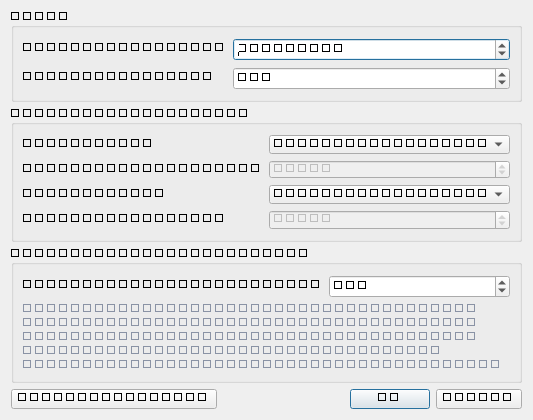
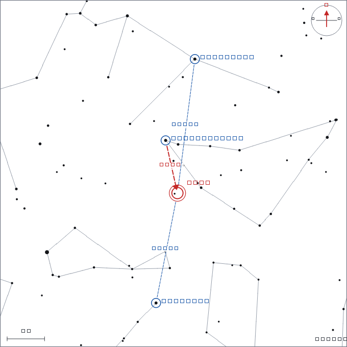

# Planejamento de observação

> Carina 0.13.2 — produto em desenvolvimento.

Aqui está o que diferencia o Carina de um planetário comum: ele não só
mostra o céu, como **monta o roteiro da sua noite** e o entrega impresso,
pronto para o campo.

---

## Os dez roteiros

Menu *Planejar → Visual*.

### Maratonas de catálogo

| Roteiro | Objetos |
|---|---|
| **Maratona Messier** | Os 110 objetos do catálogo de Charles Messier |
| **Maratona Caldwell** | Os 109 da lista complementar de Patrick Moore |

A tradição da maratona Messier é ver o maior número possível numa só
noite. O Carina ordena os alvos pela **urgência**: quem se põe primeiro
vai primeiro. Por isso o roteiro costuma abrir com as galáxias de Virgem
e da Cabeleira, que estão mergulhando no oeste.

### Maratonas temáticas

| Roteiro | Critério |
|---|---|
| **Aglomerados abertos** | Magnitude até 8,0 |
| **Aglomerados globulares** | Magnitude até 9,5 |
| **Nebulosas** | Emissão, reflexão e planetárias até magnitude 10,0 |
| **Nebulosas escuras** | Tamanho a partir de 40′ — elas não têm magnitude, vivem de contraste |

### Melhores objetos da noite

Reúne o que há de mais espetacular: objetos de céu profundo com nome
próprio famoso, **os planetas** acima do horizonte e **a Lua** (quando
há fase para ver). O passo é esticado para o roteiro **cobrir a noite
inteira** — é um passeio, não uma corrida.

### Listas do período

| Roteiro | O que traz |
|---|---|
| **Destaques do mês** | Objetos bem posicionados em **todas** as noites do mês |
| **Destaques da estação** | Idem, para o trimestre da estação |

Estes dois **não têm horário de parada**: são listas do que vale a pena
durante todo o período. O critério é exigente de propósito — o objeto
precisa passar da altitude mínima nos dias 5, 15 e 25 de cada mês, para
que a lista continue verdadeira em qualquer noite.

> **A estação é calculada pela sua latitude.** A mesma data de agosto é
> *Inverno* no Rio de Janeiro e *Verão* em Paris, e as listas são
> diferentes — como devem ser.

Para não concentrar tudo no zênite da estação, há um **teto por
constelação**: sem ele, os quarenta objetos do inverno austral cairiam
todos em Sagitário.

### Estrelas brilhantes

As mais brilhantes da sua noite, ordenadas por brilho — que é como se
aprende o céu. Cada uma traz a constelação, a **cor da estrela** (do
índice B−V) e a rota até ela.

---

## A janela da noite

Menu *Planejar → Configurar planejamento* (`Ctrl+Shift+O`), ou o menu
**Configurar** de dentro de qualquer janela de plano.

### Ritmo

- **Tempo por objeto** (3 a 10 minutos, padrão 4): quanto tempo você
  pretende passar em cada alvo. É o que espaça as paradas.
- **Altitude mínima** (padrão 20°): abaixo disso a atmosfera degrada
  demais a imagem, e o objeto é descartado do roteiro.

### Início e fim

Cada extremo da noite pode vir de:

| Opção | Quando começa/termina |
|---|---|
| **Noite astronômica** (padrão) | Quando o Sol está 18° abaixo do horizonte — o céu de fato escuro |
| **Crepúsculo civil** | Logo após o pôr do sol (Sol a 6°) |
| **Pôr / nascer do sol** | O instante do ocaso e do nascer |
| **Horário fixo** | Uma hora que você digita |

O horário fixo é interpretado no **fuso do observador** — se você
configurou o Atacama, "22:00" é 22:00 de lá.

### A regra do céu claro

Esta é a parte importante. Se você esticar a janela para além da noite
astronômica, o trecho com o céu ainda claro **só recebe objetos bem
brilhantes** — magnitude até 5,5 por padrão, ajustável.

A razão é prática: agendar uma galáxia de magnitude 10 num céu ainda
azul é frustração garantida. Nesses horários entram Vênus, a Lua,
M 42, M 45 e companhia. Eles aparecem **em azul** na lista e marcados
como **"céu claro"** no PDF.

Se você mantiver o padrão (noite astronômica), essa regra nunca chega a
atuar — a janela inteira já é escura.

---

## Lendo o roteiro

Cada linha traz hora sugerida, objeto, nome próprio, tipo, magnitude,
tamanho, altitude naquele horário, **instrumento recomendado**,
constelação e distância à Lua.

### O instrumento recomendado

O menor instrumento com que o alvo vale a pena:

| Rótulo | Critério |
|---|---|
| **A olho nu** | Magnitude até 5,5 |
| **Binóculo** | Até 8,5 |
| **Pequeno telescópio** | Até 10,5 |
| **Telescópio médio** | Mais fraco que isso |

Objetos **muito grandes** (mais de 1°) ganham um degrau de vantagem: o
brilho se espalha, mas o contraste de campo largo compensa — é o caso
das Híades, do Véu e das Nuvens de Magalhães. Nebulosas escuras são
sempre alvo de binóculo: elas vivem de contraste, não de brilho.

### As cores

- **Laranja** — o objeto está perto da Lua e será prejudicado. O raio da
  zona lunar cresce com a fase: uma Lua cheia lava o céu a dezenas de
  graus.
- **Azul** — foi agendado com o céu ainda claro.

### O painel de detalhes

Clique numa linha e veja embaixo:

- **melhor horário** e a altura naquele instante;
- **o que ver** — o que esperar do objeto conforme o tipo;
- **ao binóculo 10×50** — o que se enxerga com o instrumento mais comum;
- **como encontrar** — a rota de star-hopping.

---

## As cartas de localização

Cada objeto do PDF ganha uma carta desenhada no estilo dos atlas
impressos:

O que está desenhado:

- **as estrelas do campo**, com o tamanho pelo brilho, e as linhas das
  constelações em cinza claro;
- **o alvo**, num círculo duplo vermelho;
- **a estrela-guia principal**, ligada ao alvo por uma **seta vermelha
  tracejada**, com a **distância em graus** escrita sobre ela;
- **duas ou três referências extras**, em azul, também com as distâncias
  — uma guia dá a direção, mas **duas permitem triangular** e confirmar
  que você chegou ao campo certo;
- a **rosa de orientação** com a seta do norte, e o leste à esquerda,
  que é a convenção celeste (o contrário dos mapas terrestres);
- a **barra de escala** em graus e o campo total da carta.

O texto conta a mesma história: *"Comece por Deneb Algedi (Capricórnio),
de magnitude 2,8, e caminhe 7,2° para sul. Para confirmar o campo,
triangule: Aldhanab (3,0) fica a 14,5° do alvo, norte dele."*

> As referências são escolhidas entre as estrelas de magnitude até 3,6 —
> as que se veem a olho nu de qualquer quintal. Se não houver duas por
> perto, o corte é afrouxado por etapas até magnitude 5.

---

## Levando para o campo

### Pré-visualizar

`Ctrl+Shift+V` abre o roteiro exatamente como ele vai sair impresso —
o próprio PDF, num visualizador com rolagem e zoom. Confira antes de
gastar papel.

### Exportar

`Ctrl+P` gera o arquivo. Ele tem duas seções:

1. **Checklist da noite** — uma linha por objeto, com **caixa para
   marcar**, horário, nome, tipo, altitude, instrumento e constelação;
2. **Um cartão por objeto** — a carta de localização à esquerda e, à
   direita, as instruções completas.

O PDF de uma maratona Messier completa tem cerca de 25 páginas. Não
economize papel: o texto é medido antes de desenhado, e nenhuma linha
se sobrepõe à seguinte.

---

## Dicas de uso

**Comece pelos "Melhores objetos"** se você é iniciante ou está com
visita. É o roteiro que impressiona.

**Use "Destaques do mês" para planejar com antecedência** — a lista vale
o mês inteiro, então serve para decidir a data da saída.

**Ajuste o tempo por objeto ao seu ritmo real.** Quatro minutos é o
padrão para observação visual rápida. Se você desenha o que vê, ou
fotografa, ponha 10 e aceite ver menos objetos.

**Não force a janela para o pôr do sol** achando que vai ganhar tempo.
Você ganha, mas só para os alvos brilhantes — e é isso que o programa
vai agendar ali.
