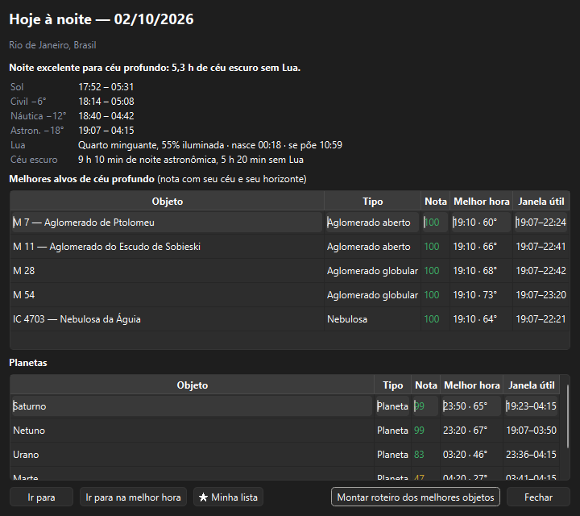
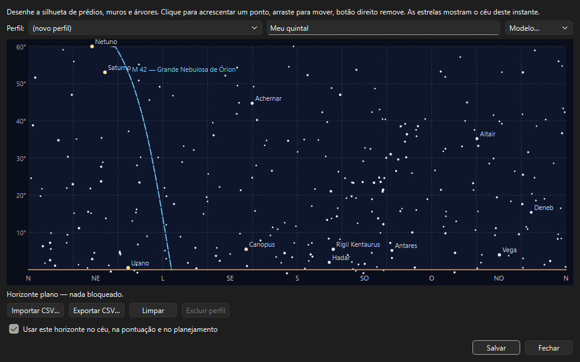
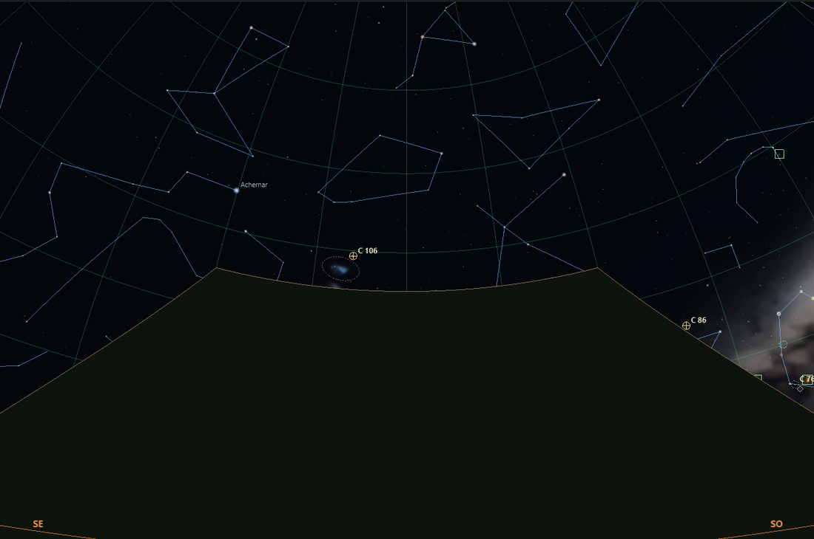
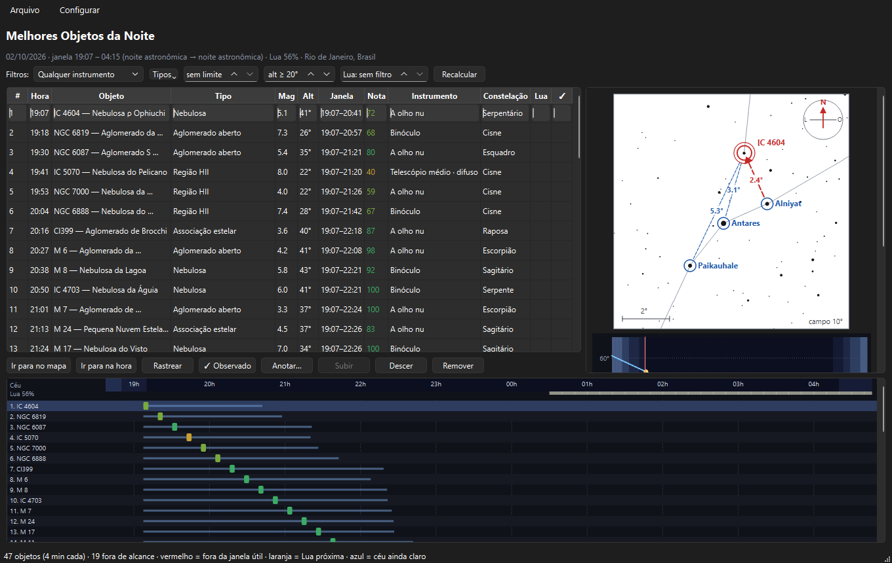
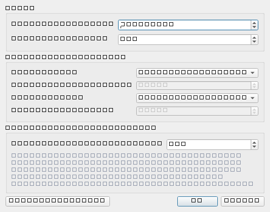
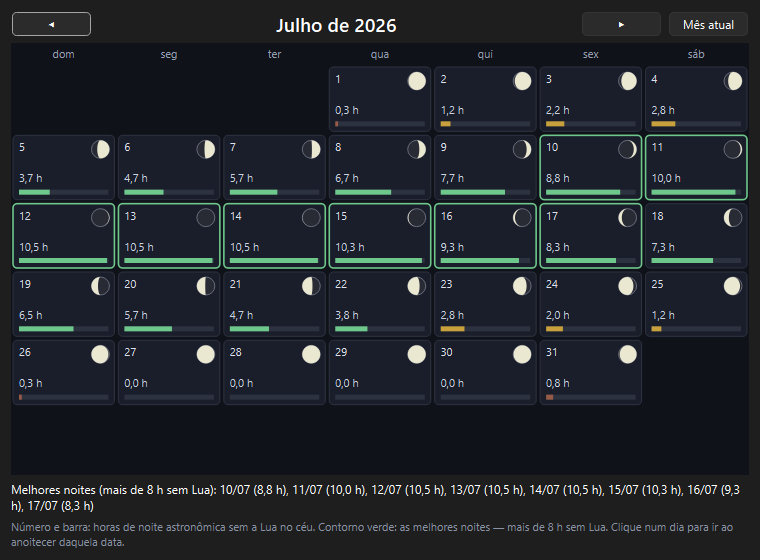
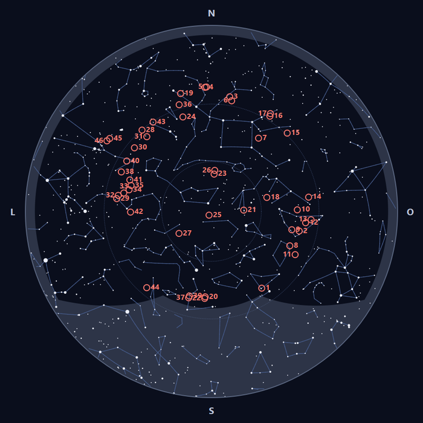
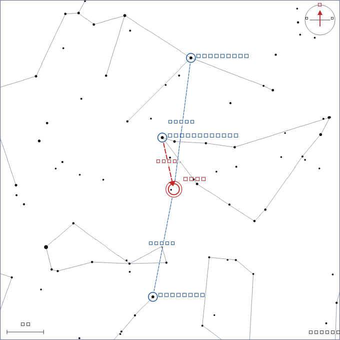

# Planejamento de observação

> Carina 0.17.0 — produto em desenvolvimento.

O Carina não só mostra o céu: ele responde **"dá para ver isto hoje, e a
que horas?"** em todo lugar, e transforma a resposta num roteiro da noite
que você leva impresso para o campo.

---

## Hoje à noite (tecla T)

*Planejar → Hoje à noite…*, a tecla **T** ou o botão **Hoje** da barra
lateral.

Numa página só:

- **a noite** — pôr do sol, crepúsculos civil, náutico e astronômico,
  nascer do sol;
- **a Lua** — fase, iluminação, nascer e ocaso, e quantas horas de noite
  astronômica ficam **sem ela**;
- **uma frase sobre a noite** — "Noite excelente para céu profundo: 5,3 h
  de céu escuro sem Lua";
- **os cinco melhores alvos de céu profundo**, pela pontuação de
  observabilidade (com o seu céu e o seu horizonte), no máximo dois do
  mesmo tipo;
- **os planetas** que valem a pena, com a melhor hora.

Dali você vai ao objeto no mapa, leva o relógio à **melhor hora**,
acrescenta à sua lista (★) ou monta o roteiro dos melhores objetos.

---

## A pontuação de observabilidade

Toda ficha, lista, busca e roteiro mostra uma **nota de 0 a 100** para a
noite, com o porquê em português:

> **Boa (68):** alto no céu (71° às 04:15), 4 h 16 min de janela, Lua (55%)
> a 36° atrapalha, exige céu razoável (Bortle 5)

Quatro fatores entram na conta:

| Fator | O que mede |
|---|---|
| **Altitude** | Na melhor hora da noite. 15° ou menos vale zero; 60° ou mais, o máximo |
| **Tempo** | Minutos utilizáveis na noite escura, acima da altitude mínima e do seu horizonte. Duas horas valem o máximo |
| **Lua** | Iluminação × proximidade ao longo da janela, mais o clareamento geral do céu quando ela está acima do horizonte |
| **Céu** | O objeto aguenta o seu céu? Magnitude contra a magnitude limite do instrumento e, para objetos extensos, **brilho superficial** contra o brilho do fundo do céu do seu Bortle |

O fator céu multiplica os outros: um objeto fraco demais para o seu céu
não fica bom só por estar alto. É ele que separa **M 31**, de núcleo
brilhante, de **M 33**, grande e difusa.

| Nota | Leitura |
|---|---|
| 75 a 100 | Excelente |
| 55 a 74 | Boa |
| 35 a 54 | Razoável |
| 1 a 34 | Difícil |
| 0 | Não visível — com o motivo ("não nasce", "fica atrás do seu horizonte"…) |

> A nota usa o **Bortle** escolhido em *Exibir → Céu → Poluição luminosa*
> e o **horizonte do quintal** ativo. Mudou um dos dois? As fichas abertas
> se recalculam sozinhas.

---

## Nasce, culmina, se põe

A seção **Hoje** da ficha de qualquer objeto (clique nele) mostra:

- **nasce · se põe** — com a refração padrão no horizonte, como nos
  almanaques; "circumpolar" quando não se põe;
- **culmina** — a hora e a altura máxima;
- **janela útil** — de quando a quando o objeto fica acima da altitude
  mínima **e** do seu horizonte, dentro da noite escura;
- **melhor hora** — a maior altitude dentro da janela;
- **a Lua** naquela hora e o **instrumento** sugerido;
- **o gráfico da noite** — altitude por hora, com as faixas do
  crepúsculo, a altitude mínima tracejada, o seu horizonte em marrom, a
  janela útil em verde e o "agora" em vermelho. Passe o mouse para ler.

Os horários batem com o almanaque do Skyfield com erro abaixo de um
minuto.

---

## O horizonte do quintal

*Local → Horizonte do quintal…*

Quase ninguém observa de um horizonte plano. Prédios, muros e árvores
escondem uma faixa do céu, e o Carina passa a levar isso em conta.

O editor mostra um panorama de 0° a 360° de azimute por 0° a 60° de
altitude, com as estrelas e os planetas **deste instante** e, se houver
um objeto selecionado, a **trajetória dele** durante a noite. Assim fica
fácil desenhar a silhueta olhando onde as estrelas somem atrás do prédio:

- **clique** num lugar vazio para acrescentar um ponto;
- **arraste** um ponto para movê-lo;
- **botão direito** num ponto o remove;
- **Modelo…** traz perfis prontos (plano, muro de 10°, vale, prédio ao
  sul);
- **Importar / Exportar CSV** troca perfis com outros programas
  (`azimute;altitude`, vírgula ou ponto decimal).

Você pode guardar vários perfis (o quintal, o sítio, a varanda) e marcar
qual está em uso. O perfil ativo:

- **eleva o solo** até a silhueta, e os rótulos de quem fica atrás dela
  somem;
- **recorta a janela útil** e reduz a nota de quem passa a noite
  escondido;
- **tira do roteiro** o objeto que só estaria visível atrás do prédio.

---

## Os roteiros

*Planejar → Roteiros*.

| Roteiro | O que traz |
|---|---|
| **Maratona Messier / Caldwell** | Os 110 e os 109 objetos clássicos, em ordem de urgência |
| **Aglomerados abertos / globulares** | Até magnitude 8,0 e 9,5 |
| **Nebulosas** | Emissão, reflexão e planetárias até magnitude 10,0 |
| **Nebulosas escuras** | A partir de 40′ — vivem de contraste, não de brilho |
| **Melhores objetos da noite** | Os famosos, os planetas e a Lua, espalhados pela noite inteira |
| **Roteiro da minha lista** | Os itens da sua lista (veja [Diário e listas](DIARIO.md)) |
| **Destaques do mês / da estação** | Objetos bem posicionados em **todas** as noites do período, sem horário |
| **Estrelas brilhantes** | As mais brilhantes da noite, com a cor de cada uma |

A ordem é a da **urgência**: quem se põe primeiro vai primeiro. Cada
objeto ganha um horário dentro da própria janela útil, espaçado pelo
tempo por objeto que você configurou.

> **A estação é calculada pela sua latitude.** A mesma data de agosto é
> *Inverno* no Rio de Janeiro e *Verão* em Paris.

---

## A janela de planejamento

### A tabela

Cada linha traz o horário, a **designação e o nome** (M 8 — Nebulosa da
Lagoa), tipo, magnitude, altitude no horário, a **janela útil**, a
**nota da noite**, o **instrumento** (com "difuso" quando o brilho
superficial é baixo), a constelação, a distância à Lua (vazia quando ela
está abaixo do horizonte) e ✓ quando o objeto já está no seu diário.

As cores ajudam:

- **vermelho** — o horário caiu depois do fim da janela útil (acontece
  quando você reordena);
- **laranja** — perto da Lua;
- **azul** — agendado com o céu ainda claro (só entra por ser brilhante).

### O painel ao lado

Clique numa linha e veja, sem abrir o PDF, a **carta de localização**, o
**gráfico da noite** do objeto e as instruções: o que ver, ao binóculo e
como encontrar.

### A linha do tempo

Embaixo, um gráfico de barras da noite: no topo, as cores do céu pelo
crepúsculo e a faixa clara enquanto a Lua está no céu; abaixo, uma linha
por parada, com a **janela útil** (traço fino) e o **horário agendado**
(bloco colorido pela nota). **Arraste o bloco** para mudar o horário de
uma parada: ela vai para a posição certa e as demais são reagendadas.

### Os botões de cada linha

| Botão | O que faz |
|---|---|
| **Ir para no mapa** | Centraliza o objeto |
| **Ir para na hora** | Leva também o relógio ao horário da parada |
| **Rastrear** | Trajetória da noite em carta polar |
| **✓ Observado** | Registra no diário |
| **Anotar…** | Nota que vai junto no PDF |
| **Subir / Descer / Remover** | Edita o roteiro e reagenda os horários |

### Os filtros

A barra acima da tabela recalcula o roteiro com: **instrumento** que você
tem (só o que vale a pena até ele), **tipos** de objeto, **máximo** de
objetos, **altitude mínima** e **distância mínima da Lua**.

---

## O instrumento recomendado

O menor instrumento com que o alvo vale a pena:

| Rótulo | Critério |
|---|---|
| **A olho nu** | Magnitude até 5,5 |
| **Binóculo** | Até 8,5 |
| **Pequeno telescópio** | Até 10,5 |
| **Telescópio médio** | Mais fraco que isso |

Dois ajustes:

- objetos **muito grandes** (mais de 1°) ganham um degrau: o contraste
  de campo largo compensa — é o caso das Híades e das Nuvens de
  Magalhães;
- galáxias e nebulosas **difusas** perdem um degrau quando o brilho
  superficial passa de 13,5 mag/arcmin², e outro acima de 15. A
  magnitude 7,9 de M 101 sugeria binóculo, mas a luz espalhada por 24′ a
  deixa no limite até num telescópio pequeno.

Nebulosas escuras são sempre alvo de binóculo.

---

## A janela da noite

*Planejar → Configurar planejamento* (`Ctrl+Shift+O`), ou *Configurar*
dentro da janela do roteiro.

- **Tempo por objeto** (3 a 10 minutos, padrão 4).
- **Altitude mínima** (padrão 20°) — vale para o roteiro, a ficha, a
  busca, as listas e o "Hoje à noite".
- **Início e fim** — noite astronômica (padrão), crepúsculo civil, pôr ou
  nascer do sol, ou um horário fixo no fuso do observador.
- **A regra do céu claro** — fora da noite astronômica só entram objetos
  bem brilhantes (até magnitude 5,5, ajustável).

---

## Calendário de noites escuras

*Planejar → Calendário de noites escuras…* (`Ctrl+Shift+N`).

Para cada noite do mês: a fase da Lua desenhada como você a vê do seu
hemisfério e as **horas de noite astronômica sem Lua** (número e barra).
As **melhores noites** — mais de 8 horas de noite astronômica sem Lua —
ganham contorno verde. No verão das latitudes médias a noite astronômica é
curta e pode não haver nenhuma; o resumo então diz qual foi a mais escura. Clique num dia para levar
a simulação ao anoitecer daquela data — é a forma mais rápida de escolher
o fim de semana da viagem ao céu escuro.

---

## Levando para o campo

### PDF

`Ctrl+Shift+V` pré-visualiza e `Ctrl+P` exporta. O arquivo tem:

1. **capa** com o **mapa da noite** — o céu visto de baixo, com cada
   parada numerada na direção e na altura em que estará no horário dela,
   círculos de 20°, 40°, 60° e 80°, os oito pontos cardeais e o seu
   horizonte sombreado. Não há estrelas de fundo: como cada parada tem um
   horário, um céu de um instante só não bateria com as posições;
2. **checklist** — uma linha por parada, com caixa para marcar;
3. **um cartão por objeto** — carta de localização à esquerda e
   instruções à direita, com nasce, culmina, se põe, janela e nota.

Todas as páginas têm cabeçalho e número. Em *Arquivo → Tema do PDF*
escolha **claro** (papel), **escuro** (o visual do Carina, para tablet)
ou **vermelho** (para não perder a adaptação ao escuro no campo).

### As cartas de localização

Estrelas do campo pelo brilho, linhas das constelações, o alvo num
círculo duplo, a **estrela-guia principal** ligada ao alvo por uma seta
com a distância em graus e **duas ou três referências extras** para
triangular. A rosa mostra o norte e o leste à esquerda, a convenção
celeste.

### CSV e texto

*Arquivo → Exportar CSV* gera uma planilha (separador `;`, vírgula
decimal). *Exportar texto* gera uma lista simples, boa para levar no
celular.

---

## Dicas de uso

**Abra o "Hoje à noite" no fim da tarde.** Em dez segundos você sabe se a
noite vale a pena e por onde começar.

**Desenhe o seu horizonte uma vez.** Todas as notas e roteiros passam a
falar do *seu* céu, não de um horizonte ideal.

**Monte uma lista ao longo da semana** (★ em qualquer objeto) e, na
noite, use *Roteiro da minha lista*: o Carina agenda só o que estiver ao
alcance e diz o que ficou de fora.

**Ajuste o tempo por objeto ao seu ritmo real.** Se você desenha ou
fotografa, ponha 10 minutos e aceite ver menos objetos.

---

## Veja também

- [Calendário do céu](CALENDARIO.md) — os eventos do mês para o seu local,
  com lembretes e exportação para a agenda.
- [A Lua](LUA.md) — o que está no terminador hoje e o planejador de foto
  lunar.
