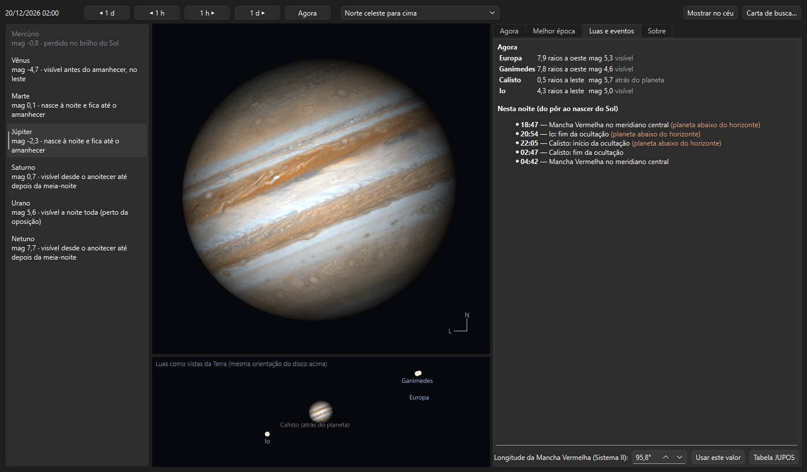
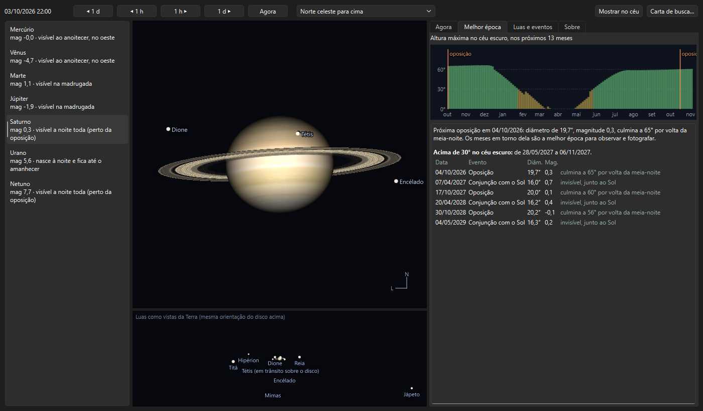
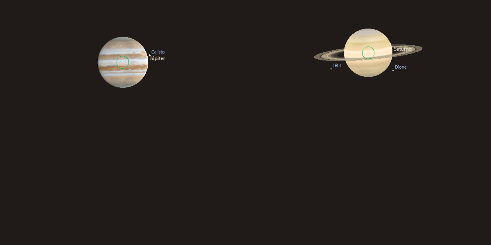

# Os planetas

> Carina 0.20.1 — produto em desenvolvimento.

Cada planeta tem a sua história do ano: quando aparece, quando fica maior
e mais brilhante, o que se vê ao telescópio. O Carina reúne isso numa janela
própria e mostra os discos no céu quando você aproxima.

---

## A janela de planetas

*Sistema Solar → Planetas…* (`Ctrl+Shift+E`), o botão **Detalhes** da ficha
de um planeta ou o botão direito sobre ele.

À **esquerda**, os sete planetas com o brilho e quando aparecem — "visível
ao anoitecer, no oeste", "nasce à noite e fica até o amanhecer", "perdido no
brilho do Sol".

No **centro**, o disco como no telescópio, com relógio próprio (**◀ 1 d**,
**◀ 1 h**, **1 h ▶**, **1 d ▶**, **Agora**) e a mesma escolha de orientação da
Janela da Lua (norte para cima, como no céu, telescópio invertido, refrator
com diagonal). A roda do mouse aproxima.

Embaixo, uma tira que muda conforme o planeta:

| Planeta | A tira mostra |
|---|---|
| **Júpiter e Saturno** | As luas como vistas da Terra, na mesma orientação do disco, com o estado de cada uma (em trânsito, atrás do planeta, na sombra) |
| **Mercúrio e Vênus** | As fases nos próximos meses, em escala: a foice cresce e encolhe ao passar entre a Terra e o Sol |
| **Marte, Urano e Netuno** | O disco nos próximos meses, em escala — Marte cresce muito perto da oposição |

**Mostrar no céu** leva o mapa ao planeta; **Carta de busca…** abre o gerador
de carta com 8° em torno dele, o jeito de achar Urano e Netuno entre as
estrelas.

### Aba "Agora"

Constelação, coordenadas, altura e azimute, nascer, culminação e ocaso,
quando ver, magnitude, diâmetro aparente, distância (e quanto a luz leva para
chegar), elongação, se está **retrógrado** e:

- **Mercúrio, Vênus e Marte** — a fase (porcentagem iluminada);
- **Marte** — o meridiano central, para saber que lado está virado para nós;
- **Júpiter** — os meridianos centrais nos Sistemas I/III e II e onde está a
  **Grande Mancha Vermelha**: no centro, perto da borda ou no lado oculto;
- **Saturno** — a **inclinação dos anéis** (e qual face está à mostra) e a
  próxima vez em que eles ficam de perfil.

### Aba "Melhor época"

- O **gráfico da temporada**: a altura máxima que o planeta alcança no céu
  escuro, dia a dia, nos próximos 13 meses, no seu local. Verde acima de 30°.
- A frase de **melhor época**: para os planetas externos, a próxima
  **oposição** (diâmetro, brilho e a altura na culminação); para Mercúrio e
  Vênus, as próximas **maiores elongações** com a altura **no fim do
  crepúsculo** — o que de fato importa no seu local.
- A lista de oposições, conjunções e elongações dos próximos anos.

> **Mercúrio e o hemisfério sul.** Nem toda elongação é igual: a mesma
> distância ao Sol deixa Mercúrio alto numa estação e rente ao horizonte em
> outra. A coluna de altura no crepúsculo diz qual vale a pena.

### Aba "Luas e eventos"

Júpiter e Saturno: as luas agora (distância ao planeta em raios, brilho,
estado) e os eventos **da noite**, do pôr ao nascer do Sol:

- **trânsitos** — a lua passa na frente do disco;
- **sombras** — a sombra da lua, um ponto preto nítido sobre as nuvens de
  Júpiter, visível em telescópios pequenos;
- **ocultações** — a lua passa atrás do planeta;
- **eclipses** — a lua entra na sombra do planeta e some;
- **passagens da Grande Mancha Vermelha** pelo meridiano central, a melhor
  hora para vê-la.

Os eventos com o planeta abaixo do horizonte vêm marcados.

#### A longitude da Grande Mancha Vermelha

A Mancha deriva ao longo dos anos (cerca de 16° por ano no Sistema II
atualmente). O Carina traz a tabela do projeto **JUPOS** até dezembro de 2025
(79°) e extrapola depois. Se você tiver um valor mais recente (dos fóruns de
observação planetária ou do próprio JUPOS), digite-o no campo da aba e clique
em **Usar este valor**; **Tabela JUPOS** volta ao padrão.

---

## No céu

Aproxime um planeta até ele ocupar alguns pixels: o ponto vira um **disco**
com a textura, a fase pela direção real do Sol e o eixo inclinado como no
céu. Júpiter mostra as faixas e a Mancha Vermelha na posição do dia; Saturno,
os anéis — a parte de trás escondida pelo globo, a da frente cruzando o
disco. As **luas** de Júpiter e Saturno aparecem como pontos com nome.

## Na ficha

A ficha de um planeta ganha diâmetro, elongação, fase (Mercúrio, Vênus e
Marte), inclinação dos anéis (Saturno), movimento retrógrado e a frase de
**melhor época**.

---

## Precisão e fontes

- **Posições dos planetas**: efemérides JPL DE440s.
- **Luas de Júpiter e Saturno**: efemérides de satélites do JPL (jup365 e
  sat441), de 2000 a 2060; conferidas contra o JPL Horizons com erro abaixo
  de 0,1″. Fora desse período as luas não são mostradas.
- **Eixos de rotação e meridianos**: modelo da IAU. O meridiano central de
  Júpiter (Sistema II) bate com o exemplo do *Astronomical Algorithms* de
  Meeus em menos de 1°.
- **Oposições e elongações** conferidas com as datas publicadas: Marte em
  19/02/2027, Saturno em 04/10/2026, Vênus em 10/01 e 01/06/2025.
- **Anéis**: a Terra cruzou o plano em 23/03/2025, e o Carina acerta a data
  em dois dias.
- **Texturas**: Solar System Scope (CC BY 4.0), a partir de mosaicos da NASA.
  São mapas médios — as faixas reais de Júpiter mudam de ano para ano.
