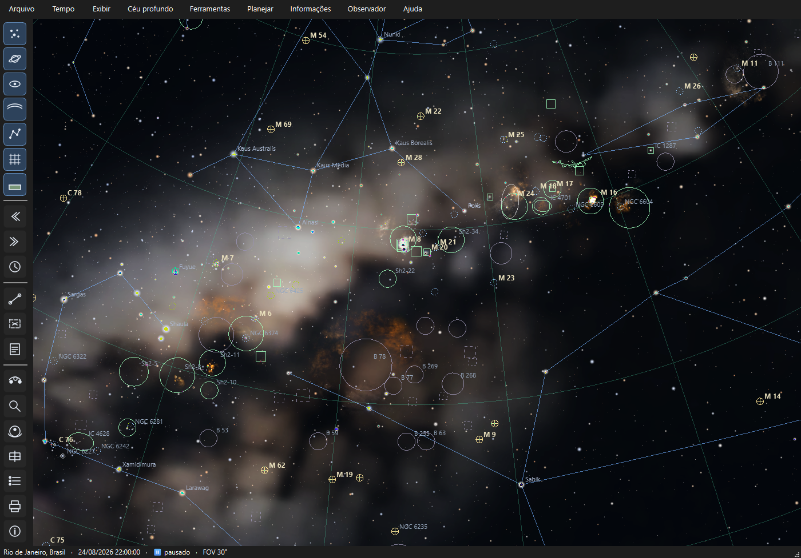
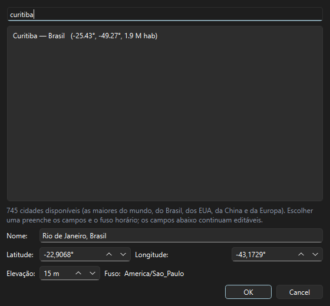
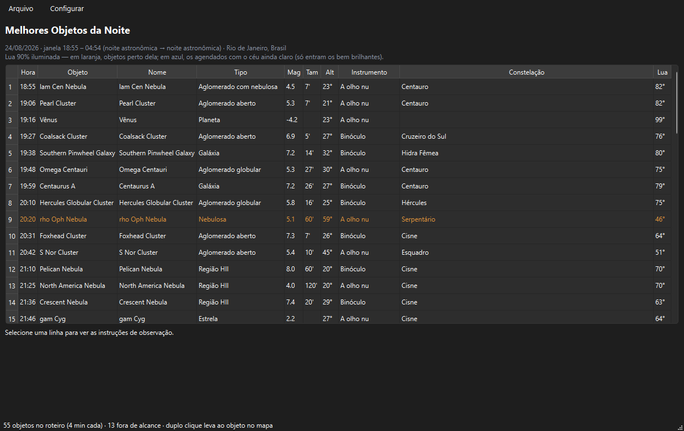

# Primeiros passos

> Carina 0.13.2 — produto em desenvolvimento.

Um passeio guiado, do primeiro clique até um plano de observação impresso
na mão. Reserve uns quinze minutos e faça junto com o programa aberto.

---

## 1. A primeira abertura

Ao abrir, o Carina mostra o **céu de agora**, visto do **Rio de Janeiro**
(o padrão de fábrica), olhando para o norte.

Três coisas para reparar:

- **A barra de estado**, embaixo: local, data e hora, velocidade do tempo
  e o campo de visão atual. É o seu painel de controle mental.
- **A barra lateral**, à esquerda: os interruptores do que aparece no céu
  e os atalhos das ferramentas.
- **A barra de menus**, em cima: tudo o que o programa sabe fazer.

---

## 2. Diga onde você está

**Este é o passo mais importante.** O céu depende inteiramente de onde
você está — em Belém e em Porto Alegre são céus diferentes.

Pressione **`Ctrl+L`** (ou *Observador → Localização*).

Digite o nome da sua cidade na busca. São **745 cidades** disponíveis: as
500 maiores do mundo mais as 100 maiores do Brasil, dos Estados Unidos,
da China e da Europa. Clique na sua e confirme com **OK**.

Repare que o **fuso horário** foi preenchido junto. A partir daí, todos
os horários que o programa mostrar — crepúsculos, roteiros, rastreamentos
— serão os do **seu relógio**, não os do computador. Isso importa quando
você planeja uma viagem para observar em outro fuso.

> **Não achou sua cidade?** Digite o nome e ajuste latitude, longitude e
> elevação à mão. Uma cidade próxima também serve: a diferença de alguns
> quilômetros é irrelevante para o céu.

---

## 3. Ajuste o céu ao seu quintal

O céu que o programa desenha, por padrão, é o de um lugar perfeitamente
escuro — o que não é o quintal de quase ninguém.

Vá em *Exibir → Poluição luminosa (Bortle)* e escolha a sua realidade:

| Classe | Onde | O que você vê |
|---|---|---|
| **1–2** | Sertão, alta montanha | Via Láctea projeta sombra; milhares de estrelas |
| **3–4** | Zona rural, sítio | Via Láctea rica e detalhada |
| **5–6** | Subúrbio | Via Láctea fraca ou só no zênite |
| **7–9** | Cidade grande | Sem Via Láctea; só as estrelas principais |

Escolha a sua e veja a tela mudar. Se você mora na cidade e escolheu 8,
o céu esvazia — é exatamente o que seus olhos vão encontrar lá fora. **É
melhor descobrir isso aqui do que depois de montar o telescópio.**

---

## 4. Navegue pelo céu

| Ação | Como |
|---|---|
| Girar a vista | Arraste com o botão esquerdo |
| Aproximar e afastar | Roda do mouse |
| Selecionar um objeto | Clique nele (ou no rótulo) |
| Ver as opções de um objeto | Clique com o botão **direito** |
| Cancelar a seleção | `Esc` |

Experimente afastar até o campo chegar a 100°, o máximo — a visão fica
parecida com a de quem deita numa espreguiçadeira e olha para cima.

### Encontre um objeto pelo nome

**`Ctrl+F`** abre a busca. Digite `M 42`, `Órion` ou `Saturno`: a lista
filtra enquanto você digita, e `Enter` leva a câmera até lá com uma
animação suave.

### Controle o tempo

O céu está vivo. Na barra lateral, os botões **◀◀** e **▶▶** avançam e
retrocedem — o passo é configurável em *Tempo → Passo dos botões*, de um
minuto a um ano. `L` acelera, `J` desacelera, `K` pausa e `8` volta ao
agora.

Um bom exercício: ponha o passo em **1 hora** e avance repetidamente.
Você vê o céu girar, o Sol nascer, o azul do dia tomar conta e as
estrelas sumirem.

---

## 5. Descubra um objeto

Ache **M 42** (a Nebulosa de Órion) com `Ctrl+F` e clique nela.

O painel da direita mostra a ficha: designações, tipo, magnitude,
tamanho, constelação, coordenadas e a posição no céu **agora**.

Agora clique com o **botão direito** sobre ela. O menu oferece:

- **Informações** — a mesma ficha, em uma janela flutuante;
- **Janela de detalhes** — imagem grande e o **gráfico de altitude ao
  longo do ano**, que responde à pergunta "quando é a melhor época para
  este objeto?";
- **Rastrear na noite** — a trajetória dele nesta noite;
- **Centralizar**, **medir a partir daqui** e outras ações.

Abra a **janela de detalhes**. O gráfico tem duas curvas: a altitude no
meio da noite (laranja) e a altitude máxima que o objeto alcança (azul).
O pico da curva laranja é a melhor época do ano — para M 42, dezembro.

### Ligue as imagens reais

Pressione **`I`**. As imagens do levantamento DSS aparecem sobre os
objetos, no lugar e no tamanho corretos. Aproxime numa nebulosa para ver.

Dica: com **`D`** você desliga as marcações (círculos e rótulos) e fica
só com a imagem limpa.

---

## 6. Planeje a sua noite

Chegamos ao que diferencia o Carina de um planetário comum.

Vá em *Planejar → Visual → **Melhores Objetos da Noite***.

O programa calculou a janela da noite, escolheu os objetos mais
espetaculares visíveis do seu local e os **distribuiu ao longo das horas**
— cada um no momento em que está bem posicionado.

Clique numa linha. Embaixo aparecem:

- **o melhor horário** e a altura em que o objeto estará;
- **o que esperar ver**, a olho nu, ao binóculo e ao telescópio;
- **como encontrar**: uma rota a partir de estrelas brilhantes, com as
  distâncias em graus.

### Ajuste o ritmo

Menu **Configurar → Configurar planejamento** (`Ctrl+,`). Ali você define
quanto tempo passar em cada objeto (3 a 10 minutos), se a noite começa no
crepúsculo ou só quando escurece de vez, e a altura mínima aceitável.

Ao confirmar, **a lista é recalculada na hora**.

### Leve para o campo

- **`Ctrl+Shift+V`** — pré-visualiza o roteiro como ele vai sair impresso;
- **`Ctrl+P`** — gera o PDF.

O PDF traz um **checklist** com caixas para marcar e, depois, **um cartão
por objeto** com uma carta de localização: as estrelas do campo, o alvo
circulado, a seta da estrela-guia com a distância em graus e a rosa
indicando o norte.

Imprima, leve, marque as caixas. É para isso que o programa existe.

---

## 7. Para onde ir agora

| Se você quer… | Vá para |
|---|---|
| Conhecer todos os recursos | [Funcionalidades](FUNCIONALIDADES.md) |
| Saber o que cada botão faz | [Interface](INTERFACE.md) |
| Dominar os roteiros | [Planejamento](PLANEJAMENTO.md) |
| Fotografar o céu | [Astrofotografia](ASTROFOTOGRAFIA.md) |
| Decorar os atalhos | [Atalhos](ATALHOS.md) |
| Entender um termo | [Glossário](GLOSSARIO.md) |
