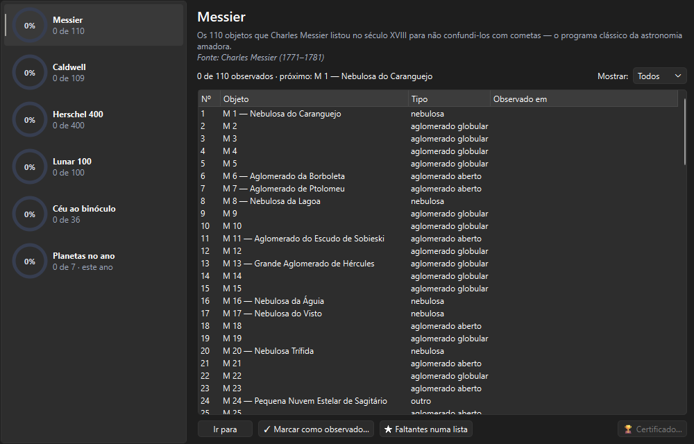

# Programas de observação

> Carina 0.22.0 — produto em desenvolvimento.

Um **programa de observação** é uma lista fechada de alvos para ir riscando
ao longo dos meses — o jeito clássico de aprender o céu com método. O
Carina acompanha o progresso pelo seu **diário**: observar um objeto pelo
caminho que for (a ficha, o botão direito, o companheiro no celular) conta
para todos os programas em que ele aparece.

*Objetos ▸ Programas de observação…* (`Ctrl+Shift+G`).

---

## Os programas

| Programa | Itens | Para quem |
|---|---|---|
| **Messier** | 110 | O programa clássico: os objetos que Charles Messier listou no século XVIII para não confundi-los com cometas. Quase todos aparecem num telescópio pequeno; alguns, ao binóculo |
| **Caldwell** | 109 | O complemento de Patrick Moore (1995), com muitos objetos do céu austral que o Messier não tem — ótimo para quem está no Brasil |
| **Herschel 400** | 400 | O passo seguinte ao Messier: a seleção da Astronomical League do catálogo de William Herschel, para telescópios a partir de 15 cm |
| **Lunar 100** | 100 | As formações lunares de Charles Wood, da mais fácil à mais difícil (ver [A Lua](LUA.md#lunar-100)) |
| **Céu ao binóculo** | 36 | A lista curada do Carina para binóculo 7×50 ou 10×50 |
| **Planetas no ano** | 7 | Os sete planetas observados ao longo do ano corrente — recomeça todo 1º de janeiro |

---

## A janela

À esquerda, cada programa com o **anel de progresso**; à direita, os itens
do programa escolhido:

- **Mostrar**: todos, só os que faltam ou só os feitos;
- a coluna **Observado em** traz a data da primeira observação;
- **Ir para** (ou duplo clique) leva o céu ao objeto;
- **✓ Marcar como observado…** abre o registro do diário;
- **★ Faltantes numa lista** cria a lista "Faltam: …" em *Objetos ▸ Minhas
  listas*, pronta para virar um roteiro da noite;
- **🏆 Certificado…** fica disponível quando o programa é concluído.

O texto acima da lista diz quantos faltam e qual é o **próximo**, na ordem
do programa.

---

## O certificado

Ao concluir um programa, **🏆 Certificado…** pede o nome que vai no
certificado (fica guardado para a próxima vez) e gera um **PDF A4** com
moldura, o título do programa, o número de objetos, a data em que você
completou e o local. Bom para imprimir e pendurar — ou para mostrar ao
clube.

---

## Dicas

- Para o **Messier**, março e abril têm a famosa *maratona Messier* no
  hemisfério norte; do Brasil, comece pelos do céu de inverno (Sagitário e
  Escorpião) e vá completando ao longo do ano. *Planejar ▸ Roteiros ▸
  Maratona Messier* monta a sequência da noite.
- No **Caldwell**, os objetos do céu austral (C 77 a C 109) são privilégio
  de quem mora no sul.
- **Planetas no ano**: Mercúrio é o mais difícil — use *Os planetas este
  ano*, nos tours extras, para saber a próxima maior elongação.

---

## Fontes

- Messier e Caldwell: designações do banco de céu profundo do Carina
  (OpenNGC e listas publicadas).
- Herschel 400: lista oficial da Astronomical League (Herschel 400
  Observing Program), por número NGC.
- Lunar 100: Charles A. Wood, *Sky & Telescope* (2004).
