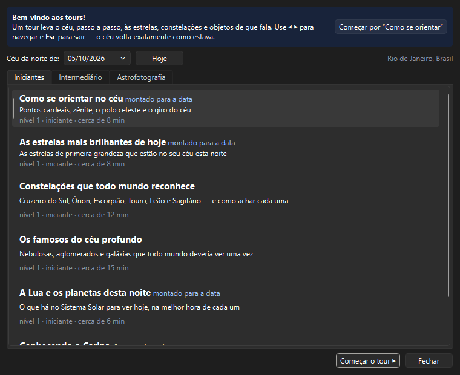
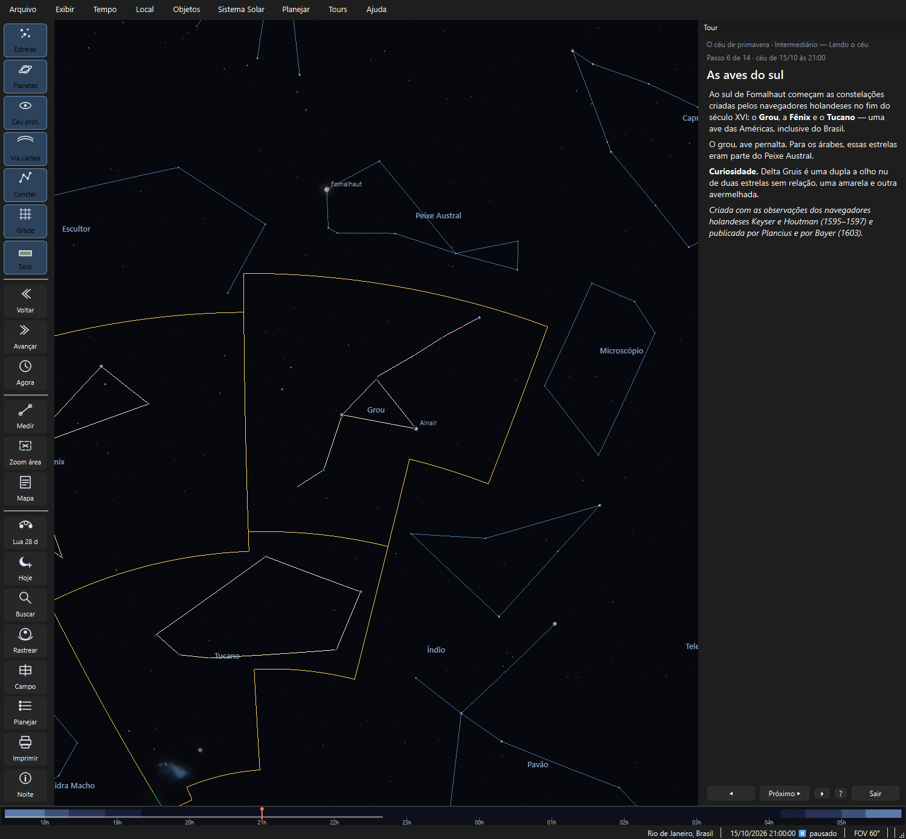
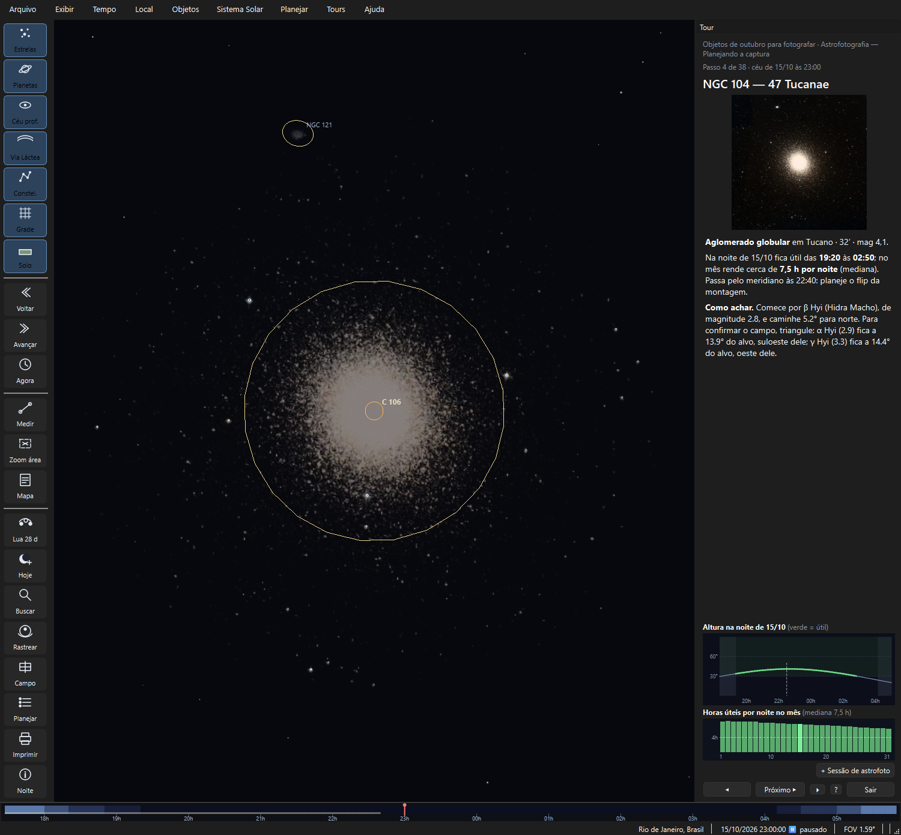

# Tours guiados

> Carina 0.20.1 — produto em desenvolvimento.

Um **tour** leva o céu, passo a passo, às estrelas, constelações e objetos
de que fala: o relógio vai à hora certa, a vista voa até o alvo, a figura
se acende e um texto curto explica o que se está vendo. Ao sair, o céu
volta **exatamente** como estava.

Há três categorias:

- **Iniciantes — Primeiro céu**: para quem ainda não conhece o céu;
- **Intermediário — Lendo o céu**: as estações, o céu de cada mês, as
  histórias das constelações;
- **Astrofotografia — Planejando a captura**: o que fotografar e quando.

---

## A galeria

*Tours ▸ Galeria de tours…* (`Ctrl+Shift+T`).

Uma aba por categoria. Cada cartão mostra o resumo, o nível e a duração, e
dois selos:

- **✓ feito** — você já concluiu o tour uma vez;
- **☾ para esta noite** — todos os alvos do tour ficam no céu na data
  escolhida. Os tours **montados para a data** (gerados) sempre servem.

No alto, **Céu da noite de** troca a data: o tour mostra o céu daquela
noite no seu local. **Hoje** volta à data atual.

O menu **Tours** também lista os tours de cada categoria, para começar
direto, e o botão direito num objeto oferece **🧭 Tours com este objeto…**
quando algum tour passa por ele.

---

## Durante o tour

O painel à direita (no lugar da ficha) mostra o tour, o passo, a **data e
a hora do céu** daquele passo e o texto. Embaixo:

| Botão | Tecla | O que faz |
|---|---|---|
| **◀** | `←` | Passo anterior — o céu volta exatamente ao que aquele passo mostrou |
| **Próximo ▶** | `→` | Próximo passo; no último, **Concluir ✓** |
| **⏵ / ⏸** | `Espaço` | Avança sozinho, no ritmo de cada passo |
| **?** | | Abre esta página |
| **Sair** | `Esc` | Encerra o tour e devolve o céu ao que era |

O que o céu faz em cada passo:

- **o relógio para** no instante do passo — às vezes outra hora da mesma
  noite ("a melhor hora desta noite" de cada constelação);
- **a vista voa** até o alvo e aproxima ou afasta para enquadrá-lo;
- **a figura se acende**: a constelação, o asterismo ou os dois;
- **camadas** podem ser ligadas (nomes das constelações, asterismos) ou
  desligadas (círculos do céu profundo, para não poluir a vista).

Nada disso altera as suas preferências: relógio, câmera, camadas, Bortle e
seleção voltam ao que eram ao sair — no fim, no meio do tour ou ao fechar o
programa.

### Passos pulados

Um passo cujo alvo está **abaixo do horizonte** (ou baixo demais para se
ver bem) na data e no local escolhidos é **pulado**, e o primeiro passo
avisa quais foram e por quê. É normal: as constelações de verão não
aparecem nas noites de inverno. Para vê-las, troque a data na galeria.

Os tours escritos para o céu do Brasil avisam quando o seu local fica
fora da faixa de latitude para a qual foram pensados.

### No fim

- **★ Guardar os objetos deste tour numa lista** cria a lista "Tour: …"
  em *Objetos ▸ Minhas listas*, pronta para virar um roteiro;
- **Próximo sugerido** começa o tour seguinte da ordem sugerida que você
  ainda não fez.

---

## Iniciantes — Primeiro céu

| Tour | O que mostra | Duração |
|---|---|---|
| **Como se orientar no céu** *(montado para a data)* | Pontos cardeais, onde o Sol se pôs hoje, o zênite, o polo celeste pelo Cruzeiro do Sul, o céu girando em duas horas e a Lua desta noite | 8 min |
| **As estrelas mais brilhantes de hoje** *(montado para a data)* | As estrelas de primeira grandeza no seu céu esta noite, da mais brilhante para a menos, com cor, distância e onde estão | 8 min |
| **Constelações que todo mundo reconhece** | Cruzeiro do Sul e os Guardiões, Órion e as Três Marias, o Escorpião, o Touro e as Plêiades, o Leão, Sagitário e o Bule — cada uma na melhor hora desta noite | 12 min |
| **Os famosos do céu profundo** | Nebulosa de Órion, Plêiades, Caixinha de Joias, Ômega Centauri, 47 Tucanae, Nuvens de Magalhães, Andrômeda e a Lagoa, com foto de cada um | 15 min |
| **A Lua e os planetas desta noite** *(montado para a data)* | A Lua e cada planeta visível, na melhor hora de cada um | 6 min |
| **Conhecendo o Carina** | O essencial do programa em oito passos: camadas, relógio, busca, ficha, botão direito, planejamento | 6 min |

A ordem da tabela é a ordem sugerida.

---

## Intermediário — Lendo o céu

| Tour | O que mostra | Duração |
|---|---|---|
| **O céu de primavera** | As noites de outubro: o "céu das águas" (Capricórnio, Aquário, Peixe Austral), as aves do sul e a Pequena Nuvem, o Escultor, o Grande Quadrado e Andrômeda, o Triângulo de Inverno se pondo e as Plêiades nascendo | 18 min |
| **O céu deste mês** *(montado para a data)* | Ver abaixo | 20 min |

> **A data das estações.** Os tours de estação mostram uma noite típica —
> 15 de outubro às 21h para a primavera — e não a noite de hoje. Fora da
> estação, o tour avisa; ao sair, o relógio volta ao que era. Foram
> escritos para o céu do Brasil (latitudes de 35° S a 5° N). As outras
> estações chegam na versão 0.21.

### O céu deste mês

Montado para o **dia 15 do mês** no seu local, no início da noite (fim do
crepúsculo náutico):

1. as **constelações que passam pelo meridiano** nas primeiras horas, com
   a história e como achar cada uma;
2. até oito **objetos para binóculo e telescópio pequeno** bem altos antes
   das 23h — os mais conhecidos e fáceis primeiro, no máximo dois de cada
   tipo —, com o instrumento indicado e a rota a partir das estrelas;
3. os **planetas** visíveis no começo da noite;
4. os **fenômenos do mês** do Calendário do céu (fases, encontros,
   eclipses, chuvas de meteoros).

---

## Astrofotografia — Planejando a captura

### Objetos do mês para fotografar

Os alvos que rendem **pelo menos 4 horas úteis por noite** no mês,
contando a **mediana** das noites — metade das noites do mês dá 4 h ou
mais, então a Lua cheia não derruba um bom alvo. Hora útil é aquela com:

- o objeto acima da altura mínima (30°);
- o Sol abaixo de −18° (noite astronômica);
- a Lua longe ou abaixo do horizonte (o mesmo critério do calendário de
  imageabilidade da Sessão);
- fora da zona do zênite, se a montagem do setup ativo for altazimutal;
- acima do horizonte do seu quintal, se houver um perfil ativo.

Os objetos vêm em **três seções, nesta ordem**: aglomerados estelares,
nebulosas e galáxias. Dentro de cada seção, a ordem é a da **hora em que
o objeto fica bom** na noite típica (dia 15): os primeiros já estão altos
ao escurecer, os últimos chegam de madrugada. São até 12 por seção.

Ficam de fora objetos muito pequenos (menos de 3′, salvo os do Messier,
Caldwell e Sharpless) e galáxias difusas demais para uma foto amadora.

Cada objeto tem um **cartão**:

- **altura na noite do dia 15**, com o trecho útil em verde, a zona do
  zênite (alt-az) em vermelho e o meridiano tracejado (equatorial alemã,
  quando o flip importa);
- **horas úteis por noite** em cada dia do mês, com a linha das 4 h —
  passe o mouse sobre uma barra para ver o valor;
- **+ Sessão de astrofoto**, que manda o alvo para a
  [Sessão](ASTROFOTOGRAFIA.md#sessão-de-astrofoto) sem tirar você do tour.

O texto diz o horário útil na noite típica, a mediana do mês, quando
virar a montagem, se o objeto **cabe no campo** do setup ativo (ou quantos
painéis de mosaico pede) e como achá-lo pelas estrelas.

---

## Asterismos

**Asterismos** são figuras conhecidas que não são constelações oficiais: as
Três Marias, o Cruzeiro (com os Guardiões e a Falsa Cruz), o Bule de
Sagitário, a cauda do Escorpião, o Hexágono de Verão, o Grande Quadrado de
Pégaso, o Grande Carro, o V das Híades e outros — 18 ao todo.

- *Exibir ▸ Linhas e grades ▸ Asterismos* (`Shift+A`) desenha todos, em
  laranja, com o nome; o menu **Tours** tem o mesmo atalho;
- **Buscar** (`Ctrl+F`) encontra um asterismo pelo nome ("três marias",
  "bule") e o destaca no céu;
- os tours acendem os asterismos de que falam.

---

## Histórias das constelações

As 88 constelações têm um texto curto em português: a **história** (o mito
ou a homenagem por trás do nome), **como achar** do Brasil, uma
**curiosidade** e a **origem** — as 48 do Almagesto de Ptolomeu, as do
céu austral desenhadas pelos navegadores holandeses e por Lacaille, as de
Hevelius.

O texto aparece:

- na **ficha**, ao usar o botão direito ▸ **Qual constelação é esta?** ou
  ao buscar uma constelação;
- nos **tours**, nos passos sobre cada constelação.

As constelações e histórias de outros povos — o céu Tupi-Guarani, o
chinês, o aborígene australiano e outros — estão planejadas para uma
versão futura.

---

## Dicas

- **Faça o tour de dia para a noite de hoje**: os tours "montados para a
  data" e os que usam "a melhor hora desta noite" funcionam a qualquer
  hora — é um bom jeito de planejar.
- **Outra data**: escolha na galeria a noite de um aniversário, de uma
  viagem ou do próximo fim de semana no sítio.
- **Do tour para o campo**: guarde os objetos numa lista e use
  *Planejar ▸ Roteiros ▸ Roteiro da minha lista* para ter horários e cartas
  de localização.

---

## Precisão e fontes

- Posições, horários e alturas são calculados pelo Carina para o seu local
  e a data escolhida (efemérides JPL DE440s).
- Textos: autorais do projeto Carina / Astronomia no Quintal, em revisão
  contínua.
- Fotos dos objetos: recortes do Digitized Sky Survey (DSS) já usados na
  ficha; serão substituídas aos poucos por fotos autorais.
- Asterismos conforme o uso corrente no Brasil; histórias das constelações
  a partir das fontes clássicas (Ptolomeu, Bayer, Lacaille, Hevelius) e da
  bibliografia de divulgação.
